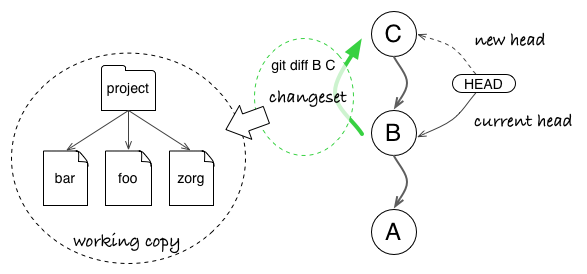
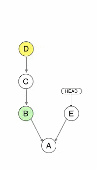
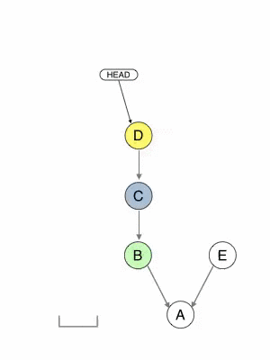
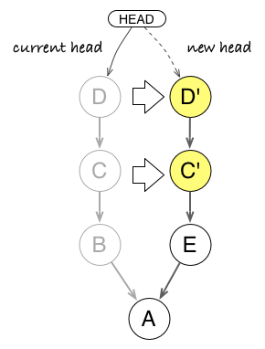
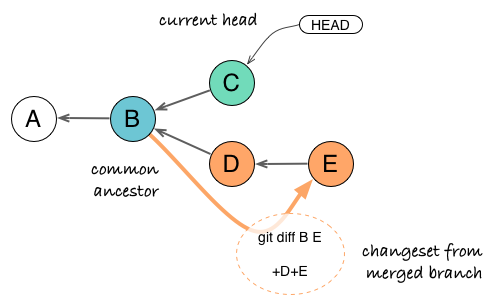
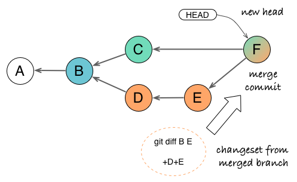
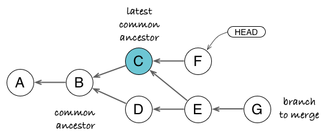
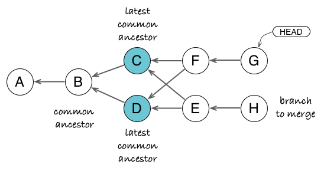
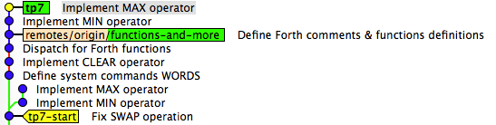

In the previous article, we saw three essential concepts of revision tools: snapshot, graph, and changeset. In the following, we can apply these concepts to understand how Git commands operate on your project. This will teach us how to think like Git.

## Updating the Working Copy (Switching between Branches, Pulling)

When you switch to another branch, or update your current branch, you change your local working copy. But the working copy actually mirrors your latest commit in HEAD (minus local modifications). Which means that Git can compute the difference between your HEAD and any given commit, then apply the transformation to update your working copy.

_When you update your working copy, you move the HEAD in the graph. Git computes the changeset between the current HEAD and the chosen one to just update files which need to change._

Think about it: to change your working copy, Git could simply wipe out previous files and dump fresh new files. But for big projects with thousands of files, this would be way too costly. Instead it patches local files, which implies it only changes what needs to be updated to mirror the new state.

There is an added benefit with this strategy. Have you noticed that you can switch to a different branch without losing local modifications? That is because Git will leave such files untouched if it does not need to patch them. This comes in handy when you start to fix something in your current branch, then realize it would be better to do it in another existing branch before committing.

But what happens if Git must patch a file section which already has local changes? It will just forbid the action, otherwise you would lose your changes before you have a chance to commit them.

## Cherry-picking

You make a cherry-pick when you want to retrieve some commits and changes from another branch, but do all changes. It is typically used for bug fix or small chores, when you really need this one change but can not afford to merge the whole branch.

_With `git cherry-pick B D`, you can copy changes from commits B and D into your current branch, without the change introduced by C. Notice that B’ and D’ are new commits: they just have the same data as their source but are independent otherwise._

Cherry-picking really embodies the whole changeset everywhere principle.

1.  You ask Git to cherry-pick a commit (or a series of commits).
2.  Git computes the changeset for the given commit.
3.  Git tries to apply the changeset in the context of your current branch.
4.  If it succeeds, it will create a new commit with the content and the metadata of the source commit (author, message, original timestamp).
5.  It if fails because the context has changed, it will produce a conflict, which you can resolve.

## Rebasing

Rebasing (be it a batch one or an interactive one) is not much more complicated once you understand cherry-pick. With cherry-pick, you copy commits from another branch onto your current head. With rebase, you copy commits from your current head onto another branch (then you move your current branch to the rebased commits).

Here is the course of action when you launch a rebase:

1.  Git computes changesets for each commit you want to copy.
2.  It pushes them in a stack, from last one to first.
3.  It pops each changeset from the stack and apply it in the same order they appear in history, effectively reproducing this history elsewhere.
4.  When performing an interactive rebase, Git will also apply the action you selected for the commit (pick, edit, squash…).
5.  If a conflict appears when applying a changeset, Git stops and asks you to resolve the conflict before continuing or cancelling the rebase.

With this workflow in mind, it is easy to understand two fringe cases which deter some people to use rebase: orphan commits coming back (for example, after a merge) and recurring conflicts during rebase.

### Advanced Git: Orphan Commits

Although rebasing is often explained as moving commits around, it is best to understand it as copying commits. In the figure below, commits C’ and D’  carries the data of C and D, but have a different ancestry: following Git rules, they are not strictly the same as C and D. If no other reference (branch, tag) points to C and D commits, they become orphan and can be garbage collected by Git later. Otherwise, they stay around and can come back to haunt you later if people are unaware of how rebase works (for example, if they merge the old branch with C and D into the new branch).

_Rebasing creates new commits C' and D' from the source C and D, changing the ancestry from B to E. But source commits stay around and can come back as duplicates if someone keeps a reference on them._

### Advanced Git: Recurring Conflicts

Take the three commits above B, C, and D. That means the C changeset expects a context as in B and D changeset expects a context as in C. Now start a rebase with commits C and D on another branch:

1.  First applying C produces a conflict because the patch context is too different.
2.  You resolve the conflict by adapting the change brought by C to the new context.
3.  You continue the rebase.
4.  But the context may now have changed too much to apply D. So a new conflict arises. Often this conflict looks familiar because you already solve a similar one in the previous step.
5.  You resolve the conflict, etc.

For someone who is just learning the rebase process, resolving a conflict at each step can be irritating, cumbersome (because you have to resolve similar conflicts), or even unnerving. When it gets too clumsy, people often cancel the rebase and tries a different solution, such as a branch merge (where you resolve conflicts once and for all), a squash and rebase, or for some workflows using Git [rerere](http://git-scm.com/blog/2010/03/08/rerere.html).

## Merging

Merging is conceptually a bit more complex as we need a fourth concept to explain it: the merge base or latest common ancestor. The latest common ancestor is the point where both branches have diverged for the last time. To merge, we need to bring back changes which have appeared in the divergent branch since the split.

_Since commit E is a snapshot and already contains changes brought by D, we just need to compute the difference (changeset) between the common ancestor B and commit E. Contrary to rebase which copies commit history, merge only takes into account consolidated changes from the latest commit/snapshot._

With the above concepts, we have a simple plan for the merge operation.

1.  Find the latest common ancestor between the two branches.
2.  Computes the changeset between the common ancestor and merged branch.
3.  Apply the changeset on current head.
4.  Let user resolve conflicts if need be.
5.  Create a merge commit with the two merge heads as parents.

### Advanced Git: More Than One Ancestor?

The example above represents the most basic scenario. But as merges can be performed multiple times in the history of two branches, you can stumble upon less intuitive cases. Then the notion of **latest** common ancestor becomes important.

_If we take the changeset from common ancestor B to G, it contains changes from D and G, but also from C through the previous merge E. But we do not want C changes since they are already in F. Instead, if we take the changeset from **latest** common ancestor C to G, it only contains changes from D, E, and G, consolidated in G snapshot._

More complex scenarios arise when merged branches start to cross each other, as in the demonstrative criss-cross merge. Then you can have multiple latest common ancestors.

_Both C and D commits can be considered as latest common ancestors of G and H. If you take the diff from D to H, you get changes from C (through E) and H, but C is already in G. If you take the diff from C to H, you get changes from D and H, but D is already in G through F. The solution is to create a virtual merge of C+D and to compute changes against it, which yields changes from E and H only. On the long run, this strategy produces more intuitive merges and less conflicts._

Most revision tools fail to handle such cases correctly (Subversion cancels the merge by screaming “missing revisions” and let you handle the case manually; Mercurial makes an arbitrary choice among common ancestors). Git resolves this case with the so-called _recursive merge strategy_, which computes a virtual common ancestor (a virtual merge of common ancestors).

For a detailed example and explanation of how this strategy works better than others, I highly recommend this [blog post and the reference links](http://codicesoftware.blogspot.com/2011/09/merge-recursive-strategy.html) by the guys from Plastic SCM. You can also see the discussion in the man page of [git-merge-base](http://git-scm.com/docs/git-merge-base) for the difference between common ancestors in a 3-way merge and in an octopus merge.

## Go Practice!

These three concepts - snapshot, graph, and changeset - are enough to start understanding how Git works on a daily basis. Of course, this is not intended as a full lesson of Git internals - for example, we only skimmed over how Git manages HEAD, branches or tags as references in the graph. But just the above explanations for basic and not-so-basic commands should give you an idea of how to reason with Git.

Now you should just go practice with your project. One good advice is to have a Git repository browser (such as the default `gitk` or GitX) open in the background. These browsers can show you a visualization of your commit graph. By refreshing the visualization after each command, you can often see how Git has transformed your history.

_This gitk screenshot shows a before/after state of a repository following a rebase. The two MIN/MAX commits above `tp7-start` tag have been rebased on top of `functions-and-more` in the `tp7` branch. In this view, you can still see the old commits, which are now orphaned, and the two new commits, which are just copies of the old ones._

_Simon Denier [@twitter](https://twitter.com/simondenier) - [@github](https://github.com/sdenier)_
