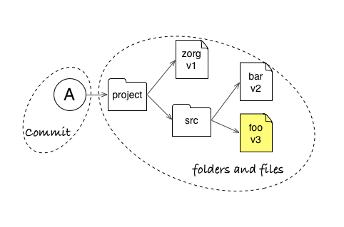
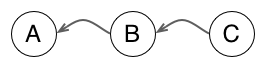
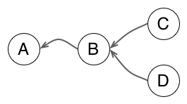
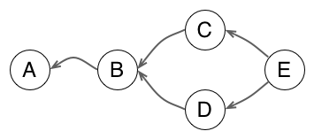
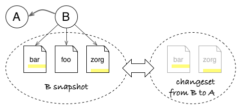
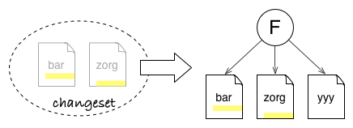
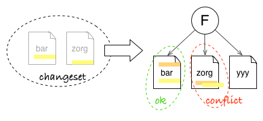
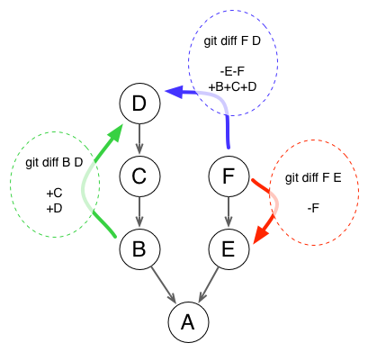

# Demystifying Git: 3 Concepts to Understand the Git Model

*Initially published on 2015-05-05.*

Git has a reputation for being a geeky tool with a steep learning curve, including a CLI with lots of options, and more concepts (staging, remote, push/pull, …) to start with than classic revision control tools.

But Git has actually a simple conceptual model and does not attempt to hide it as implementation details. Learning this model and how Git operates on it will greatly speed up your apprenticeship of the tool. In other words, you will start to think like Git, and then finding or mixing commands will become much easier, with the occasional dive into the online help to get the right option.

To begin with your apprenticeship of the Git model, you just need the concepts of snapshots, graph, and changesets.

> If you have already used other revision tools but think Git is too hard to learn for your needs, this article is for you! However, if you have never used a revision tool before, why not [try Git](https://try.Github.io/levels/1/challenges/1) first? Come back when you have played with the basic commands but want a better grasp about what is going on.

## Git Stores Snapshots (aka Commits) of your Project

We start with an easy one. A commit is snapshot of all files in your project, starting from the root. In other words, it is a copy of all tracked files at the time of creating the commit.

The reason it starts from the project root folder is that you should save a consistent version of your project, including related changes across all subfolders (and not forgetting one in the process).

With this guarantee, we can be sure that checking out a commit will give us that exact state we saved, be it a release version, a buggy one which needs a fix, or a work in progress.

_Commit A points to a snapshot of all project files (files bar, foo, and zorg). Even if you only change the foo file (in yellow) to create a version v3 in commit A, Git will remember that you want zorg file in version 1 and bar file in version 2 for this snapshot._

## Git Represents Relationships between Commits (aka History) as a Graph

In any revision control system, commits do not exist in isolation but are linked through a parent-child relationship, which remembers where a commit comes from (what was the previous state before the commit).

So you can start to view the history of your project as a line of successive states. The above figure presents a common representation of history in a Git repository, where the arrow indicates that commit B **knows** that its parent is commit A (in Git, parent commits do not know about their children, so the arrow points “backward”). In the same manner, commit C knows its parent B, and by transitivity its grandparent A…

When two commits share the same parent, you start to have divergent branches. Each line can continue to grow in concurrent ways.

When time has come to merge two branches together, Git creates a commit with two parents. The result is that the history is now a directed graph of commits.

The concept of graph to represent the history of a project seems like pretty intuitive, even an obvious choice. You might be surprised by the fact that not all revision control tools use a graph as a first class representation. For example, Subversion works with independent directory-trees to represent branches and only stores branch/merge as meta-data: the lack of a full graph representation makes it difficult to follow merge history in SVN.

But more importantly, the history graph allows us to compute the difference between two states - which leads us to the next concept: changeset.

## Git Can Compute Changes between any Two Commits of your Project

When you create a commit B from commit A, you create a new snapshot. But you can also see it as an incremental evolution upon the previous commit. This contribution brought by the commit makes a group of indivisible changes, which is called a changeset.

_A snapshot stores the full state, independent of history: B commit points to files bar, foo, and zorg. A changeset only records what has changed: B changeset describes local patches (in yellow) in bar and zorg files. Both concepts are actually interchangeable and can be used to model the history graph._

### What Is in a Changeset? And What to Do With It?

The interesting bit about changesets is that they can be used as blueprint to copy the changes brought by B elsewhere. This is possible because a changeset contain just enough information about the transformation.

_Applying the B changeset onto commit F will only modify files bar and zorg. It does not care that unmodified foo file from B is absent in F or that there is a yyy file in F._

Git, for example, see changes at the level of lines in text files. When you view a patch in Git (which is the textual representation of a changeset), you see something like that:

    diff --git a/app/scripts/Results.js b/app/scripts/Results.js
    index 98d5f30..ade6329 100644
    --- a/app/scripts/Results.js
    +++ b/app/scripts/Results.js
    @@ -8,18 +8,20 @@ angular.module('golive')

    -    var polling;
    +    var previousStatus = dataSource.status,
    +        polling;

         function pollData() {
    -      var previousStatus = dataSource.status;
           dataSource.status = 'polling';
           return $http.get(dataSource.url).success(function(data) {
             stage.name = data.name;
             dataSource.status = previousStatus;
    +      }).error(function() {
    +        dataSource.status = 'error';
           });
         }

To see this in action, just run `git diff HEAD~1 HEAD` in a repository. It will show you the changes between your latest commit and the previous one, directly in patch format.

A patch file will register the following information:

*   which file is impacted by the change (`app/scripts/Results.js`)
*   where is the next change section in the file (`@@ -8,18 +8,20 @@`)
*   lines removed by the change, prefixed by **-**
*   lines added by the change, prefixed by **+**
*   as a result, changed lines appear as removed (old version) then added (new version)
*   _unchanged_ context lines before/after/between changed lines
*   and so on for all sections and all files in the changeset

Git needs only to match the target files, line positions and textual context to make the changes described by the patch. In other words, it does not care about files from the snapshot which are untouched by changes. Even more, it does not care if other sections of the file have changed too. So it is easy for Git to copy changes from a commit on top of a different snapshot, provided context has not changed too much (otherwise, Git will detect and notify conflicts).

_Changeset can update bar file, even if there is already a change in another place. But it can not update zorg file automatically, as the local context for the patch has changed. It will let you resolve the conflict._

### Changesets Anytime Anywhere

Things start to become interesting when you know that Git can compute changesets (and patch files) on the fly between any two commits of your project. That means not only how to transform commit A into its child commit B, but also:

*   the transformation from B to its grandchild D (in green below)
*   the transformation from branch F to parallel branch D (in blue)
*   or, why not, the reverse transformation from F to its parent E (in red, to cancel a change for example)

_You can read the `git diff` form as `git diff [from] X [to] Y`._

In other words, Git is super effective in computing state transformations and applying such transformations elsewhere (well, most RCS can do the same, but some are more effective than others).

## A Conceptual Model to Understand Git in Action

This brief introduction to three concepts of revision tools is enough to understand the essentials of Git. In the [next article](./demystifying_git2.md) we will put this knowledge in action to explain how some Git commands operate on your project.
