Resiliency without a Name: the Distributed Reactive Loop
========================================================

TODO
- figures for the use cases
- streamline all sections to focus on the "thought framework" idea for reasoning, and no other project concern (budget...)
- normalize state/status ? (job/printer)
- rethink the title?

Once upon a time, a small team of developers were tasked with designing a pooling system for 3D printers over the internet - something akin to a system dispatching print jobs across printers. It was an interesting challenge as we knew nothing of the customaries of 3D printers: how it works, how it fails, what kind of communication to expect. After the initial probe & discovery stage, it becames more and more obvious that we had to design a distributed system in a not so common way. Because 3D printers are dealing with physical process, which takes a certain time and needs some manual operation, we had to get back to the basics and design our system around two properties: keeping things consistent in the right place and making the overall system resilient in face of inconsistency.

Challenges of 3D printing (in a distributed context)
----------------------------------------------------

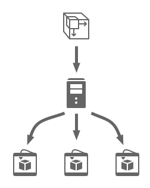

- jobs take a long time, very long in term of nowadays computer time: from a few minutes for the smallest object to well over a day for big jobs, with many objects taking at least a few hours.
- printers are still new things, a bit fragile, with failures happening from time to time.
- so job failures might happen but can be costly: you lost hours of machine time, and you have to clean up the mess before taking a new job.
- Even after each job, a human operator needs to extract the piece, check it and clean up the printer before the next task.

So we are not exactly in the realm of pure software jobs, which takes a few minutes, can fail quickly, cleaned up and redispatched on another worker - nor in the realm of industrial-ready, fault-resilient machines, which would handles most maintenance tasks by themselves and even be able to clean up a failed job.

How (not) to design and think of a distributed system
-----------------------------------------------------

Every now and then, when thinking about distributed systems, engineers go all the rage with plenty of services and love to throw together a bunch of servers, load balancers, job queues, storage nodes to build a highly-available, highly-resilient, highly-scalable systems. With modern days conception, there are bonus points for using micro-services, each micro-service "customarily" holding a single responsibility, easier to understand, easier to deploy, easier to maintain.

However, there have been many warnings over the last years, even "horror stories", that micro-services systems are not *easier* to design and understand. Especially as for each micro-service, you have to think of the ways it will communicate with other services, but also the ways such communication would fail.

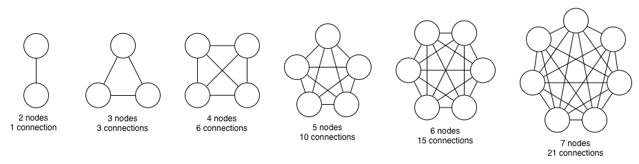

In a graph vision, this means you have to think about the n nodes of your system, but also about the m ways nodes communicate between them (with m somewhere between n-1 and n\*(n-1)/2). "In other words, the more you add micro-services, the more you multiply how they interact and fail with each other."

"more details about the resiliency challenge - choose/merge, first for idea, second more practical"

For the reasons given above, it was obvious from the start that our main challenge would not be system availability or scalability, but rather the resiliency to fault in the system: job failure, but also communication failure, for example when a connection would be lost and a printer could not receive or send messages to the pooling system. Having to deal with such a constraint was new to us.

We had to design fully autonomous worker, able to perform their job of monitoring the printer while processing an item, even with a long loss of connection/communication. And we had to design a supervisor, which could fully retrieve and reconciliate the state when communication would be back with the worker.

A Thought Framework for Resiliency: the Distributed Reactive Loop
-----------------------------------------------------------------

Since we are wandering into unknown territories, the most sensible thing to do is to simplify the system, simply to make it easier to reason about. To this end, we remove any intermediary (such as message queues) between the supervisor node and the worker node. Both nodes communicate directly through a full-duplex channel. When removing intermediaries, we also take care of limiting data redundancy between nodes, so that state is easier to reconcile in case of inconsistencies.

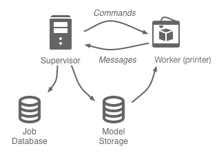

Each node has a primary objective and property which it strives to fulfill, regardless of the system status. The supervisor handles requests from customers and updates from workers. It must be available at all time, even if its response are outdated. On the contrary, the worker focus on consistency with its current job. It monitors and mirrors precisely the state of the printer job, and continue to do so even in case of network failure. For the worker, there is no need or no rush to send updates about the job, as long as it keeps things consistent.

We have simplified the structure and stated the primary role of each node. Now we must explain how both nodes communicate with each other. The communication protocol defines how progress can happen overall the system. The core tenet of our framework is that each time both nodes are connected and have an opportunity for communication, they would make a round-trip, exchanging data and commands. This framework is called a **reactive loop** because it always starts with a request for the current worker state (considered locally consistent), so that the supervisor properly reacts to it. This small exchange is enough to let the supervisor refresh its internal state, and to send new commands to the worker for the next thing to do.

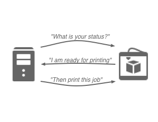

Together, those design decisions make it easier to reason about the system by having a simple **thought framework**, with basically distributed decisions being made in one place - the supervisor. It also imposed a clear separation of concerns between worker and supervisor, with the worker focusing on keeping its own state consistent (with regards to job processing in the printer), while the supervisor focused on worker commands and state reconciliation whenever it could communicate with workers. Overall, it makes it easier to reason about failure and recovery modes.

Printer Automata
----------------

Before we move to the use cases for the reactive loop, we must describe how the worker represents the printer state. The worker is easily modelled as a finite-state machine. Each state indicates what the printer is currently doing, which action to take or monitor, and which messages sent by the supervisor are valid. The supervisor also requests the state on different opportunities, which allows it to perform update and send commands. The figure below shows a simplified version of the FSM: there are three normal states, which models the regular process; one special state catches errors to allow the worker to recover.

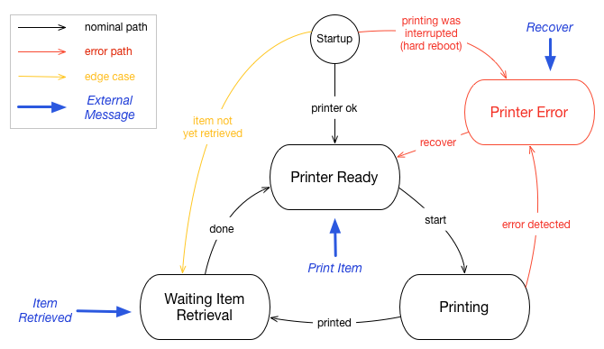

After the initial startup, the worker goes by default to the **ready state**. This is the normal state to wait for print jobs from the server. When a print message is received, the worker goes into an **printing state**, monitoring the physical printer until it has finished. It sends progress update to the supervisor but does not accept any message. Once the job is done, the printer is not readily available as the item must be retrieved from the printer box. The worker transitions into a **waiting for retrieval** state. It can not accept a new job in this state. It simply waits for a signal that the human operator has retrieved the item.

Whenever the worker detects an issue with the printer, it goes into the **error state**, waiting for recovery. Indeed, when the printer fails, the item is most often in an unknown condition. An operator must look into the printer box, extract and discard the item, and clean up the mess. Then he can signal that the printer is ready for a new job. Notice also how there is a path at startup to the error state: if ones pulls the plug while printing (for an emergency stop), the worker will go and stay in error state when coming back online.

This automata represents the internal workings of the printer. But from the point of view of the supervisor, the worker can also be in an **offline state**, meaning communication is impossible. The worker may simply be turned off, or it may have lost the connection. The loss of server connection does not prevent the printer from performing some task. For example it might continue to print an item. This case has implications about what happens when a printer is offline but also when it comes back online.

The Reactive Loop, Illustrated
------------------------------

Thinking with the reactive loop is as simple as imagining a use case and playing it through the loop. The below examples will illustrate most of what can happen in the system.

### Prerequisite: Print Job Creation

To set things into motion, a customer should of course issue a print order. The server takes care of creating and dispatching print jobs on a subset of 3D printers to fulfill the print order. Each print job is first registered as to do, regardless of the printer state. This way, the job becomes part of the printer queue. It will be consumed when the printer is ready, depending on one of the following use case.

### Nominal Case: Start a Job Immediately

When a job request is created on the server, the server checks whether the printer is connected and sends a request for state. The printer answers "ready to print" so the supervisor looks one job to do in the current printer queue and sends it to the printer.

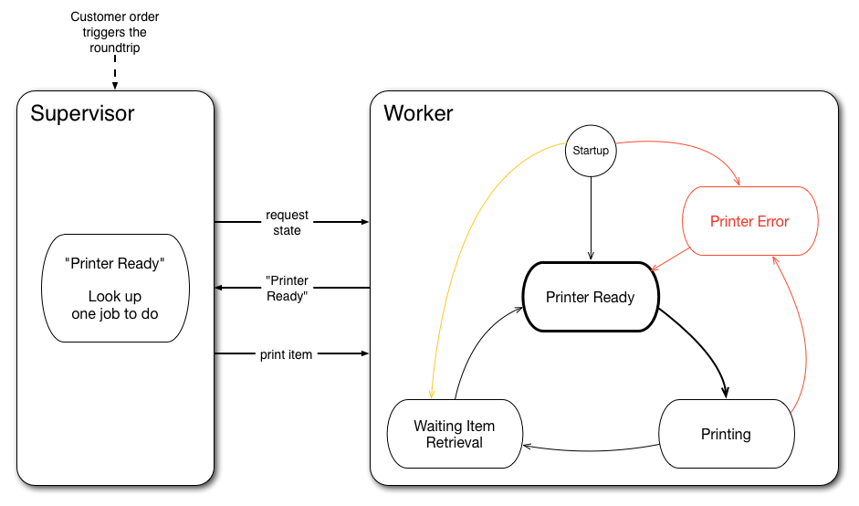

### Postponing a Job

When the server requests the state, the printer might be processing another job. In this case, the round-trip stops immediately with a no-op. Since the job is already in queue, it will be processed later.

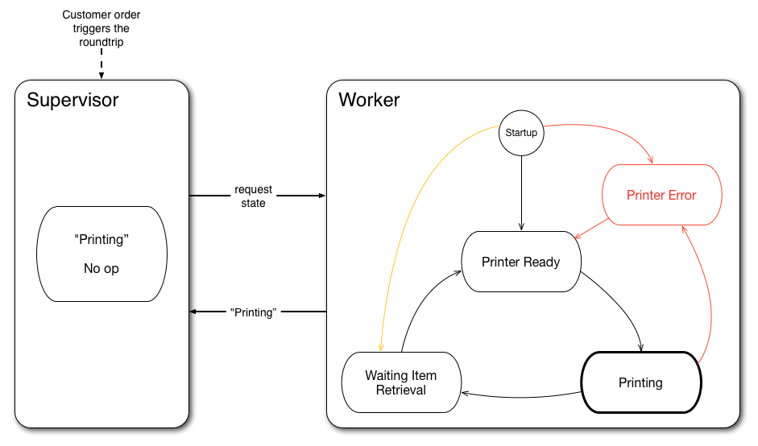

### Consuming a Job Queue

Finishing a Job and Starting a Job from the queue.

Once the printer has finished printing, it gets itself into a waiting state, because the object must be extracted by a human operator before the next operation. When receiving this update, the server takes care of updating the job status in the database. The operator can then use an interface to signal the server the item has been effectively retrieved. At the next round-trip, when the printer indicates it is still waiting for retrieval, the server can check the job status and sends the command has been effectively retrieved. The printer goes back to ready status, then the server can dispatch the next job.

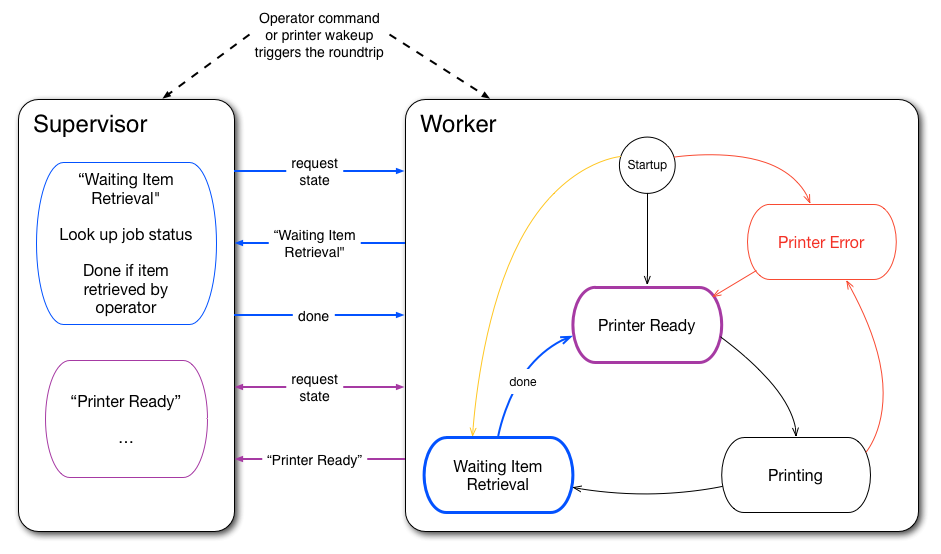

### Starting after Wakeup/Reconnection

When the printer comes back online in the ready state, how does he get deffered jobs? In such a case, a simple round-trip to the supervisor indicates the printer is ready and can trigger a job command if one is available in the queue.

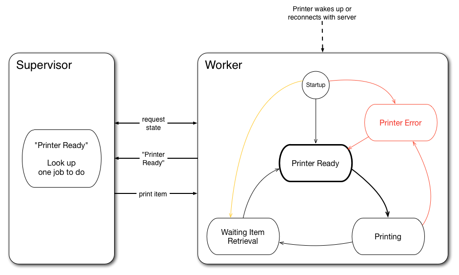

### State Reconciliation

Update and transition messages may be lost when the connection is down. But an interrupted connection should not alter the printer processing. For example, the printer might finish its job and go to the "waiting retrieval" state. Meanwhile the job is still marked in progress in the supervisor. Next steps can not happen until state has been reconciled. After reconnection, a status exchange is enough so that the supervisor updates the job state. Only then can the process proceed normally with the retrieval stage before going back to ready.

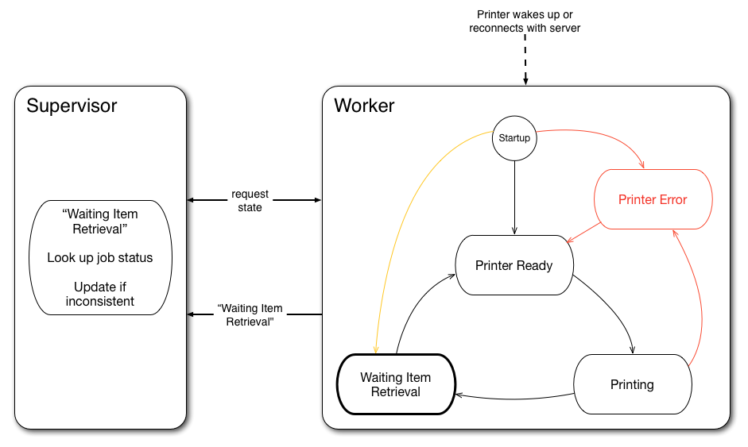

### Error Detection and Recovery

Failure can happen anytime during a printing process: the model might be faulty, the mechanimc can break, or the printer could simply power off when someone pulls the plug. In most case, it is impossible to resume a failed 3D process, because of the physical properties of the material. When this happens, the worker simply goes into an error state. This can happen whether the printer is online or offline. Once the printer is online again, the roundtrip is enough for the supervisor to detect the error state and notify the job as failed.The process is then similar to the "waiting retrieval" state. The operator cleans up the mess, checks the printer is operational, then signals the job as "recovering" for the supervisor. At the next roundtrip, when the printer sends the error state and the supervisor sees the job as recovering, it can send the recover signal to the printer. This signal puts the printer back in ready state, which can then start over.

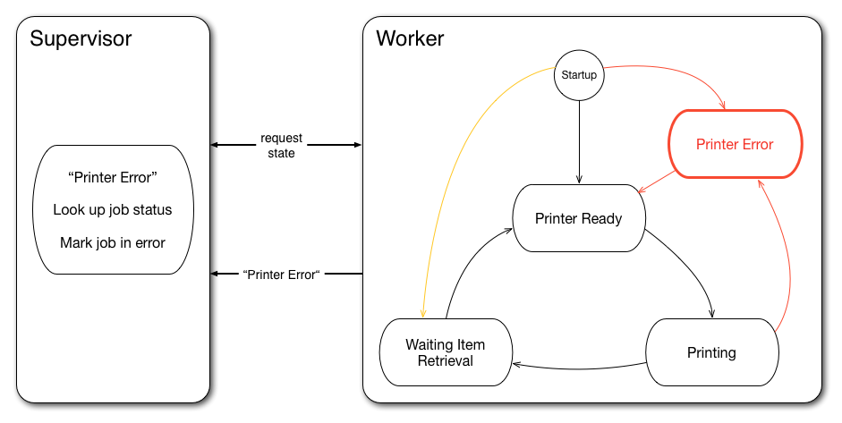

More principles/properties of the reactive loop?
------------------------------------------------

*The reactive loop is characterized by a roundtrip between the worker and the supervisor. But this roundtrip needs to be triggererd by some events. On the supervisor side, this can a customer order or an operator action. On the worker side, this can be a transition in the worker automata.*

"limit the redundancy of data between nodes, so that state would be easier to reconcile in case of inconsistencies."

Progress/Liveliness: some times both system can work independently (i.e. disconnected), for example when printing is going on. But overall both systems need to be online together to make progress.

Comparison with an independant queue system:
- can use well-tested, reliable/available system (esp. SAAS): this means other systems relies on it for synchronization. Depending on the design, the system could make progress without supervisor and worker being simultaneously online.
- more systems to synchronize, more state to reason about: supervisor state and job queue. A job should not be started on another printer if we are not sure it has been cancelled on the first one.

**note about the extensibility of the system/thought framework**
- do we need a new state in worker?
- which message need to be exchanged? status update, command
- how the supervisor would react to this new state given prior knowledge (nominal case, fault detection, fault recovery) : state update/reconciliation, next command

digression about the CAP theorem
--------------------------------

Conclusion
----------

[Icons by Icons8](https://icons8.com)
