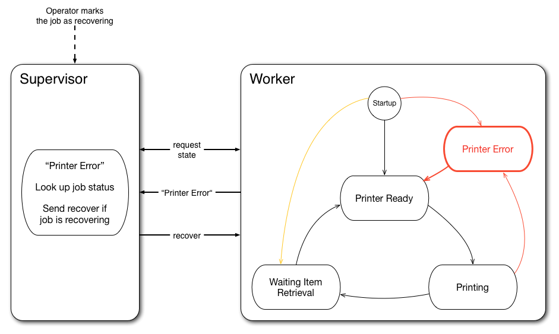

The Distributed Reactive Loop: Handling Resiliency with a Simple Thought Framework
=========

Once upon a time, we were tasked with designing a distributed system for 3D printers across the internet - something like a pool of workers for processing jobs in parallel. A the time we knew little of the customaries of 3D printing: how it works, how it fails, what kind of communication to expect. After the initial probe & discovery stage, it becames obvious we had to design a distributed system in a not so common way. Because 3D printers are dealing with a physical process, taking some time to complete and requiring manual operation, we went back to basics and focused on two properties: keeping things consistent locally and making the overall system resilient in face of inconsistency. This is the story of how we designed our system to handle such properties.

Challenges of 3D Printing - in a Distributed Context
----------------------------------------------------

From a faraway point of view, distributed 3D printing is not different from the job parallelization we often stumble upon in the cloud. Given one model and some quantities, create some jobs and dispatch them on available workers.

But when tackling the customaries of 3D printing, we quickly had to face the following evidence.

- 3D jobs take a long time, very long in term of computer time: from a few minutes for the smallest items to well over a day for big ones, with many regular objects taking at least a few hours.
- 3D printers are still a new thing, fragile machineries, with failures happening from time to time.
- Job failures can and will happen, and they can be costly: you lose hours of printer time, and you have to clean up the mess before taking a new job.
- Even after a successful job, a human operator is required to extract the item before the next job can be taken.

This is different from what we often expect when it comes to job processing in distributed context: fast jobs, cheap processing, "cost-free" mistake, automatic retry, and a pool of standard, virtual workers, running without manual intervention.

We had to design a system for long-running jobs, which would closely mirror what was going on, so that no precious processing time is lost because of inaccurate reporting and nothing harmful could happen. This means, for example:

- ensuring we had -eventually- an accurate status of whether the job has succeeded or not;
- ensuring the printer would not take another job while the previous item was still in its enclosure (obviously, a full-speed encounter between the printer head and a previous piece of hard plastic could result in some catastrophic damage).

How (not) to Think and Design a Distributed System
--------------------------------------------------

When thinking about distributed systems, developers love to throw together a bunch of servers, load balancers, job queues, storage nodes to build a highly-available, highly-resilient, highly-scalable system. With modern days conception, there are bonus points for splitting the tasks across multiple micro-services, each micro-service customarily holding a single responsibility, easier to implement, easier to deploy.

But given the above reasons, it was obvious that our main challenge would not be availability or scalability, but rather resiliency to fault in the system: job failure, but also communication failure, could happen any time, for example when a connection would be lost and a printer could not receive or send messages to the system.

There have been many warnings over the last years, even "horror stories", that micro-services systems are not *easier* to design and understand, because you have to handle the cost of communication. From a graph point of view, you have to think about the *n* nodes of your system, but also about the *m* ways nodes communicate between them (with *m* somewhere between *n-1* and *n\*(n-1)/2*). In other words, the more you add micro-services, the more you multiply how they can interact and fail with each other.

Since we were wandering into unknown territories, the most sensible thing to do was to simplify the system, make it easier to reason about. To this end, we removed intermediaries (such as message queues), starting with just the core nodes required to perform the task: a server/supervisor and some workers.

A Thought Framework for Resiliency: the Distributed Reactive Loop
-----------------------------------------------------------------

We consider two primary nodes in our system: a supervisor in charge of dispatching and monitoring jobs overall, and a worker in charge of monitoring a printer. Both nodes communicate directly through a full-duplex channel. By removing intermediaries, we also take care of limiting data redundancy between nodes, so that state is easier to reconcile in case of inconsistencies.

Each node has a purpose which it follows, regardless of the system status. The supervisor handles requests from customers and updates from workers. It must be available at all time, even if its responses are outdated. On the contrary, the worker targets job consistency. It monitors and mirrors precisely the state of the printer, and continue to do so even in case of network failure. For the worker, there is no need or no rush to send updates about the job, as long as it keeps things consistent.

We have simplified the structure and stated the purpose of each node. Now we must explain how both nodes communicate with each other. The communication protocol defines how progress can happen overall the system. The core tenet of our protocol is that each time both nodes are connected and have an opportunity for communication, they would make a roundtrip, exchanging data and commands. The roundtrip is triggered by some events: on the supervisor side, this is a human interaction, such as a customer order or an operator action; on the worker side, this can be a transition in the worker automata, or simply the worker going online.

We called this protocol a **reactive loop** because it always starts with a request for the current worker state (considered locally consistent), so that the supervisor properly reacts to it. This small exchange is enough to let the supervisor refresh its internal state, and to send new commands to the worker for the next thing to do.

Together, those design decisions make it easier to reason about the system by having a simple **thought framework**, with basically distributed decisions being made in one place - the supervisor. It also imposed a clear separation of concerns between worker and supervisor, with the worker focusing on keeping its own state consistent (with regards to job processing in the printer), while the supervisor focused on worker commands and state reconciliation whenever it could communicate with workers. Overall, it makes it easier to reason about failure and recovery modes.

Printer Automata
----------------

Before illustrating the reactive loop with use cases, we should describe how the worker represents the printer state. The printer is easily modelled as a finite-state machine. Each state indicates what the printer is currently doing, which action to take or monitor, and which messages sent by the supervisor are valid. The figure below shows a simplified version of the FSM: there are three normal states, which models the regular process; one special state catches errors to allow the worker to recover.

After the initial startup, the worker goes by default to the **ready state**. This is the normal state to wait for print jobs from the server. When a print message is received, the worker goes into an **printing state**, monitoring the physical printer until it has finished. It sends progress update to the supervisor but does not accept any message. Once the job is done, the printer is not readily available as the item must be retrieved from the printer box. Instead, the worker transitions into a **waiting for retrieval** state. It simply waits for a signal that the human operator has retrieved the item, so that it can finally go back to the **ready state** and accept a new job.

Whenever the worker detects an issue with the printer, it goes into the **error state**, waiting for recovery. Indeed, when the printer fails, the item is most often in an unknown condition. An operator must look into the box, extract and discard the item, and clean up the printer. Then he can signal that the recovery is done, which resets the job and moves the printer to the **ready state**. Notice also there is startup path directly to the error state: if ones pulls the plug while printing (for an emergency stop), the worker will go and stay in error state when coming back online.

This automata represents the internal workings of the printer. But from the point of view of the supervisor, the worker can also be in an **offline state**, meaning communication is impossible. The worker may simply be turned off, or it may have lost the connection. The loss of server connection does not prevent the printer from performing some task. For example it might continue to print an item. This case has implications about what happens when a printer is offline but also when it comes back online.

The Reactive Loop, Illustrated
------------------------------

Thinking with the reactive loop is as simple as imagining a use case and playing it through the loop. The below examples will illustrate most of what can happen in the system.

### Prerequisite: Print Job Creation

To set things into motion, a customer should of course issue a print order. The server takes care of creating and dispatching print jobs on a subset of 3D printers to fulfill the print order. Each print job is first registered as to do, regardless of the printer state. This way, the job becomes part of the printer queue. It will be consumed when the printer is ready, depending on one of the following use case.

### Nominal Case: Start a Job Immediately

When a job request is created on the server, the server checks whether the printer is connected and sends a request for state. The printer answers "ready to print" so the supervisor looks up one job to do in the current printer queue and sends it to the printer.

### Postponing a Job

When the server requests the state, the printer might be processing another job. In this case, the roundtrip stops immediately with a no-op. Since the job is already in queue, it will be processed later.

### Consuming a Job Queue

Because a manual operation is required to retrieve the item from the box, the printer can not automatically takes another job once finished printing. Instead it follows a two-step process through the supervisor to ensure that the current item status is finally done before taking another job.

Once finished printing, the printer goes into the waiting state. When receiving this state, the supervisor updates the job status in its database, and notifies the operator that the item is ready. Then the operator can signal the supervisor that the item has been effectively retrieved, marking the job as done in the database. This happens whether or not the printer is online. When the next roundtrip happens, and the printer is still waiting for retrieval, the supervisor checks the job status and signals it has been effectively retrieved. The printer can finally go back to the ready state, where another roundtrip triggers the next job in queue.

### Starting after Wakeup/Reconnection

When the printer comes back online in the ready state, how does it get deffered jobs? A simple roundtrip to the supervisor indicates the printer is ready and can trigger a job command if one is available in the queue.

### State Reconciliation

Update messages may be lost when the connection is down. But an interrupted connection should not alter the printing process. For example, the printer might finish its job and go to the "waiting retrieval" state. Meanwhile the job is still marked in progress in the supervisor. Next steps can not happen until state has been reconciled. After reconnection, a status exchange is enough so that the supervisor updates the job state. Only then can the process proceed normally with the retrieval stage before going back to ready.

### Error Detection and Recovery

Failure can happen anytime during a printing process: the model might be faulty, the mechanism can derail, or the printer could simply be powered off because someone pulls the plug. In most case, it is impossible to resume a failed job, because of the physical properties of the material. When this happens, the worker simply goes into an error state. This can happen whether the printer is online or offline with the supervisor. Once the printer is online again, a roundtrip is enough for the supervisor to detect the error state and notify the job as failed.

The process is then similar to the "waiting retrieval" state. The operator cleans up the mess, checks the printer is operational, then signals the job as "recovering" for the supervisor. At the next roundtrip, when the printer sends the error state and the supervisor sees the job as recovering, it can send the recover signal to the printer. This signal puts the printer back in ready state, which can then start over.

Discussion: Some Properties of the Reactive Loop
------------------------------------------------

Distributed systems are full of loopholes and it is easy to make mistakes. This article primarily focus on the foundations of the reactive loop, driven by simplicity and ease of reasoning. However, other thoughts were in our mind when developing this project. This section intends to offer complementary points of view about the properties and limitations of the reactive loop design.

### Liveness versus Reduced Inconsistencies/Resiliency

We could have made the obvious choice to use an independent job queue system. Many of them have been created, for different usage. Some are available as SAAS, which removes partly the maintenance burden. Given their high reliability and availability, it is interesting to use them as the backbone for the system communication. In particular, they enable a better tolerance for network partitioning. For example, the supervisor and the worker may not need to be online at the same time to make some progress. On the contrary, the reactive loop implies that both nodes be connected at the same time to eventually make progress - even if they can work independently of each other most of the time. This is of course a reasonable assumption if the supervisor is designed to be available - the worker just needs some communication window from time to time to make progress.

One disadvantage of the independent queue system is that it involves an intermediate storage, which implies some redundancy in the data. As stated before, by limiting data redundancy between nodes, state is easier to reconcile in case of inconsistencies with the reactive loop. When a problem arise and the system needs recovery, it is easier to fix the state across two subsystems than across three.

Resiliency is often achieved through automatic job retry or visibility timeout with queue systems. However, given the cost of 3D printing, we hardly want the system to start an apparently failed job on another printer, if we are not sure it has been cancelled on the first one. So while an independent queue system would offer better liveness, we favor the simple resiliency offered by the reactive loop.

### How do We Handle Communication Issues (Delivery Issue, Inconsistent Messages)? And a Note on State Design

Basically, the reactive loop framework favors some functional mindset/command-query separation (state updates happening independently of commands). Nodes process messages they receive but do not care if a sent message is processed on the other side. This implies that undelivered messages are simply lost. They are not stored in a queue for later delivery. Simply the loop will retry the next time it has an opportunity to run. In the same spirit, if a message would be delivered a bit late and become "stale" with respect to the printer status, the printer would simply reject it. Again, the message would be lost but it does not matter. The supervisor takes a new message as an opportunity to reconcile its internal state.

Care must be taken when designing printer FSM and transitions. Basically, we have two classes of printer state:

- either an "active" state (for example, printing), from which the printer will transition automatically when need be (and during which it does not accept supervisor commands).
- or a "blocking" state (for example, "waiting for retrieval"), from which the printer can not transition until the right supervisor command is received.

In other words, in the current design, the supervisor only sends a command when the printer is in a blocking state. There is no nominal case where an "active" state change happens while the supervisor sends a command related to the previous state. It could still happen for example if the printer would go into error state (then, see the description for the error case). Overall, this mindset greatly reduces cases where printer could receive inconsistent messages.

This also impacts the design of item status on the supervisor/database side, which should represent just what happened with "micro-statuses". A good example of this is the "waiting for retrieval" state:

- when the supervisor receives the update for this state, it flags the item as being ready for retrieval. In this case, the supervisor can do nothing more and does not send any command to the printer.
- once an operator has effectively notified the supervisor that the item is retrieved, the item status is flagged as done.
- next time the supervisor and the printer perform a loop run (which happens immediately after the above action if they are connected), the combination of "item done" + "waiting for retrieval" status triggers the supervisor to send the command "done", which enables the transition back to the ready state.

Here, an event-driven approach works best to model the status through which an item goes. It prevents the model to become inconsistent, by having micro-steps which have a single source of transition.

### Discovery and Scalability

A typical concern for distributed systems is how "dynamic" they can be. Can we add new nodes to the system easily? How does it scale?

When printers come online (after power up or reconnection), they registered themselves dynamically on the supervisor. However, service discovery is not the primary purpose of the reactive loop and could be delegated to a dedicated service if need be.

The supervisor model presented here is a bit of a simplification with respect to the current implementation. The supervisor node creates a websocket handler for each printer, which enables full duplex communication. So in reality, the reactive loop is implemented at the level of the websocket handler and the printer client. There are as many reactive loops on a supervisor node as there are connected printers. While this article focus on the reactive loop implemented by the handler-printer relationship, the supervisor node has other responsibilities, like dispatching some actions on target handler(s), and answering client requests through a regular REST API.

Second, to support resiliency and scalability, supervisor reactions should be "stateless", in the same sense as a REST server. A handler only stores the state of the connection, no data about the printer status or job. Whenever a loop run implies some state, the supervisor will look up the data in the database - as for any web system, state synchronization ultimately relies on the database. A practical limit for a supervisor node would be the number of simultaneous websocket connections it can handle. Then, stateless supervisors can be easily duplicated as a service and moved behind a load balancer to scale up.

### Extensibility of the Reactive Loop

An important property of any framework is how easy it is to extend. Especially in the course of incremental development, new use cases arise and involve changes in the communication protocol. We had the opportunity to test extensibility during some further evolution and the process is rather easy.

The first step to consider is whether a new state is involved in the printer automata, how it connects with other states, and what are its failure modes. Once the FSM is clarified, we can think of the communication protocol: we specify the status update and the commands to be exchanged. Finally, the supervisor needs to define proper behaviors in reaction to this state. Such behaviors often depend on inspecting the database content to determine the right path: are we in the nominal case, what is the next command, do we need to update or reconcile state, can we detect or recover a fault?

Final Thoughts before We Part
-----------------------------

Most often we rely on existing solutions because they are proven and most problems fall back to the same. However, it is also easy to take everything as a nail when all you have is a hammer. It is good to recognize such cases and be able to go back to the design board. With the reactive loop, we focus on resiliency and ease of reasoning because we were discovering a new domain.

Finally, we would like to point out we did not design the reactive loop as some kind of mental toy or funny experiment in engineering. On the contrary, we were acting on a limited budget so designing something simple was paramount. In the end, having a simple thought framework made us more confident when changes were brought in the system.

Some figures made with [Icons by Icons8](https://icons8.com)
