# Punched - Checked - Traced: how to Deal with Punches for Orienteering Races (the Geco Development History)

From 2008 to 2015, I spent a lot of my personal time developing Geco, a software to manage orienteering races. What began as an algorithmic challenge for an edge case in a peculiar race (called Orient'Show) for a niche sport, would take up many thoughts as new challenges and features came around.

## A Bit of Backstory: Orient'Show and Geco

In 2006 I was glad to participate in the first ever Orient'Show organized in France, near Lille. If you can picture orienteering, you have a detailed map of the terrain around, with a course drawn on it, and you use your navigation skills to run around and find course controls. In general, you must find controls in order and if you forget/jump one, you are either disqualified or given a time penalty depending on race rule. This is often called a mispunch (MP, missing punch). Orienteering races typically takes place in natural terrain, from 30 minutes to much longer time. Orient'Show (nowadays it is more often called Ultrasprint) is designed as a very short event, with races ranging from 30s to 5 minutes, in multiple rounds, on semi-artificial terrain (including labyrinthic features). Given the high number of controls and the fast pace, runners do not check they punch the right control - they must be confident enough - but they take a time penalty if they mispunch - for example if they take one control for another.

https://en.wikipedia.org/wiki/Orienteering#Ultrasprint

Nowadays electronic punching is common at all orienteering events. Each runner carries a chip which records control number and split time. After the finish one can read the chip and let the software checks whether the runner is OK or MP (mispunched) and computes the final time (including penalties).

## Problem Definition

Take a simple course with a start, four controls, and a finish. The runner must punch the four controls codes 31, 32, 33, 34 in order to be ranked. But he may also punch controls which are not on the course, or he may mispunch by skipping/jumping some. Anyway, this defines the two main inputs for a checking algorithm:

- the list of controls for the course, in order
- the list of punches, as taken in order by the runner

Depending on race rules, we can define three types of output with increasing degrees of precision:

- a binary output OK or MP (Missing Punch), where we don't care about the number of MPs
- the precise number of Missing Punches, because we care about time penalties
- a detailed trace which shows which controls are ok and which one are missing in runner punches - this is often useful to explain their results to runners

In the example above, we can compute the three different outputs as follow:

- checks that control 31 is missing in punches, and stops immediately with MP
- detects that they are two missing controls, and computes time penalties accordingly
- computes a trace which tells that control 31 is missing, control 32 is ok, control 33 is missing and replaced by 36, control 34 is ok

So far this seems very basic with no algorithmic difficulty. But course setters in orienteering like to be creative and with the advance of electronic punching, new course schemas became available: butterfly loop and phi loop.

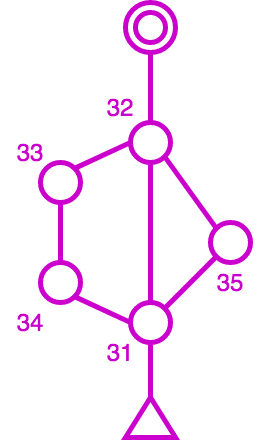

Basically, this means that some controls can be reused in a course, which create loops in the course design. Loops are used mostly in mass start events to split packs of runners: runner would run loops in different orders but at the end, they would cover the same distance and face the same orienteering choices from control to control so variations in loop order are considered equal.

From the algorithmic point of view, this means that a control number can appear multiple times in a trace. The challenge then is to compute an accurate number of penalties as well as a detailed trace to explain how the runner performs against the course (especially of course when they are missing punches).

Let's take the following punches corresponding to the butterfly course: 32, 31, 33, 31, 34, 35, 31, 36. Notice that before and after each loop, the runner should punch control 31.

Notice that jumping a punch is the simplest case for mispunch. Over the years, race stress can trigger a lot of behaviors: skipping a full loop, taking a loop in reverse, or even taking the wrong map at start (and thus running a completely different course than what is expected).

## Computing penalties and trace for a course with butterfy loops

In computer algorithms, there are a number of metrics which compare two sequences between them to find differences. Edit distances such as [Levenshtein distance](https://en.wikipedia.org/wiki/Levenshtein_distance) compute the number of addition, deletion, or substitution of characters: for example mispunches can be seen as deletion or substitution of controls. The algorithm used by Geco is actually based on the [Longest Common Subsequence Problem](https://en.wikipedia.org/wiki/Longest_common_subsequence_problem). We compute the longest common (non-continuous) subsequence between course controls and runner punches iteratively in a matrix. From this matrix of sequence lengths we can compute two things:

- the number of mispunches, as the difference between the number of course controls and the number of correct punches in the subsequence;
- a trace which explains added and mis punches by backtracking through the matrix.

Here is a sample matrix for the butterfly example above (for the detailed algorithm, see https://github.com/sdenier/Geco/blob/master/src/net/geco/control/checking/InlineTracer.java#L51). The **top row** shows course control ; the **left column** shows runner punches.

|   |  S| 31| 32| 33| 31| 34| 31| 35| 31| 36|
|---|---|---|---|---|---|---|---|---|---|---|
|  S|  0|  0|  0|  0|  0|  0|  0|  0|  0|  0|
| 32|  0|  0|  1|  1|  1|  1|  1|  1|  1|  1|
| 31|  0|  1|  1|  1|  2|  2|  2|  2|  2|  2|
| 33|  0|  1|  1|  2|  2|  2|  2|  2|  2|  2|
| 31|  0|  1|  1|  2|  3|  3|  3|  3|  3|  3|
| 34|  0|  1|  1|  2|  3|  4|  4|  4|  4|  4|
| 35|  0|  1|  1|  2|  3|  4|  4|  5|  5|  5|
| 31|  0|  1|  1|  2|  3|  4|  5|  5|  6|  6|
| 36|  0|  1|  1|  2|  3|  4|  5|  5|  6|  7|

So the length of the longest common subsequence (LCS) is given by the number in the last cell (lower right) in the matrix: here there are 7 controls in common between the course and the punches. Since the course sequence has 9 controls, this gives us 2 mispunches - but which ones? Using the subsequence length computed in each cell, we can backtrack in the matrix to find a correct interpretation (for details, see the backtrack function https://github.com/sdenier/Geco/blob/master/src/net/geco/control/checking/InlineTracer.java#L78)

The idea (starting from the end) is to compare the course control and the punch:
- if they are the same, we can proceed to the previous control and punch, i.e. with the previous cell in diagonal
- if they are different, we must choose which previous cell define the previous LCS between the left one, the top one, or the left-top one (in diagonal); depending on the chosen cell, this implies a mispunch, an added punch, or a substitution (mispunch replaced by an added punch)

Let's follow an example step by step. In the first three steps (from the end), controls and punches match, so we follow the diagonal. This gives us the following trace (built from the last): 35, 31, 36.

On the fourth step in diagonal, expected course control is 34 (column header) but punch is 31 (row header) so this is a mismatch!

Inspecting the surrounding cells (left, top, and top left) allows us to choose the next one: the heuristic tells us to choose the one cell which max the longest common subsequence length.

So in this case, we move to the left cell. This means that we skip course control 31 - in other words, this is a mispunch. We keep punch 34 since it can very well be in the longest common subsequence path. Anyway, this gives us the following trace: -31, 35, 31, 36. -31 is just one way to mark control 31 as missing.

Then on next cell punch 34 matches with control 34 so we can continue along the diagonal, as well as for the next cell. This gives us 31, 34, -31, 35, 31, 36. But on next cell, we have another mismatch with punch 31 ≠ control 32. This time the LCS heuristic tells us to take the top cell (LCS = 1) since it is higher than in diagonal (LCS = 0) and it has priority over the left (LCS = 1) (see https://github.com/sdenier/Geco/blob/master/src/net/geco/control/checking/InlineTracer.java#L78). This means we discard punch 31 for trace validity but we keep looking for control 32 among punches. The trace gives us: +31, 33, 31, 34, -31, 35, 31, 36. +31 indicates this is an added punch, i.e. not counting towards trace validity (even if control 31 appears elsewhere in the course).

On the next cell control and punch 32 match. Then we have no more punches to iterate upon but still one control left in the course. The algorithm must finish in the top left cell (at the start) so we move to the left, which indicates again a mispunch for the given control. Our final trace is then: -31, 32, +31, 33, 31, 34, -31, 35, 31, 36 (this is one of the two edge cases in the algorithm, the other being of course beginning with added punches).

This looks like a simple example yet still shows how the LCS heuristic performs locally to choose a plausible trace.

### Another Example with Substitution

One case which we did not cover in the previous example is when the max LCS shows up in the diagonal cell: this means we have both an added punch in the row and a missing control in the column, which we call a substitution marked -31+32 (for example). In other words, the competitor most likely punches the added control instead of the right one without checking the code. If you want, take your time to dive into the matrix, see how it is built and how to backtrace. What can you tell about it?

|   |  S| 31| 32| 33| 34| 31| 35| 32|
|---|---|---|---|---|---|---|---|---|
|  S|  0|  0|  0|  0|  0|  0|  0|  0|
| 31|  0|  1|  1|  1|  1|  1|  1|  1|
| 35|  0|  1|  1|  1|  1|  1|  2|  2|
| 32|  0|  1|  2|  2|  2|  2|  2|  3|
| 33|  0|  1|  2|  3|  3|  3|  3|  3|
| 34|  0|  1|  2|  3|  4|  4|  4|  4|
| 31|  0|  1|  2|  3|  4|  5|  5|  5|
| 34|  0|  1|  2|  3|  4|  5|  5|  5|
| 32|  0|  1|  2|  3|  4|  5|  5|  6|

If we take a look at the course we have 7 controls but a max LCS length of 6, which implies we have one mispunch. But if we compute the trace we have a much more precise picture: 31,+35,32,33,34,31,-35+34,32.

Can you guess what happened? The course is one combination of a Phi-loop, but it looks like the competitor misses control 35 on the second part of the loop (and took instead control 34 again, which is an example of substitution). But control 35 appears as added as the beginning. This can be understood as the competitor running the Phi-loop in the wrong order. Still, regardless of what really happened in the terrain, the LCS algorithm minimizes the number of mispunches and count only 1 mispunch for this run. This is one of the great force of this algorithm - to expect the best from the competitor, even when he magnificently screws up (which can happen quite often with the stress and fatigue of competition). In this case this could be simply that the runner did not understand in which order to run the Phi-loop, or took a map with the wrong Phi-loop combination for himself. But more strange things can happen in real competition, such as this one time when a competitor took a loop *backwards* during a final stage (this can give the organizer some headscratching/panick attack, because it gives lots of mispunches and added punches but all with the right course controls).

### New Feature Unlocked: Automatic Course Detection

The fun thing when you have a trustful algorithm is that you can start to build new features and workflow on top of it. For Geco such a feature is the automatic detection of course for any competitor.

Classically one would need a list of competitors and their chosen course to be registered in the system before the race, so that the algorithm can check punches against the course chosen by competitor. But if you check punches for each course of the race, the algorithm can compute the number of mispunches for each. In good faith, you can then [select the one with the less mispunches](https://github.com/sdenier/Geco/blob/master/src/net/geco/control/ecardmodes/CourseDetector.java#L121) as the most likely course ran by the competitor. Best case (and most likely) is that you find one course with 0 mispunch, because the competitor just performed normally.

Besides the algorithmic fun, the best thing is that you can reinvent/simplify the organization process. Instead of a full pre-registration effort, you can just go with minimal setup (the configuration of courses is the bare minimum) and just let things happen once competitors come back from their race. An archive of known competitors can help to fill in identity details when punches are read from their electronic card. In Geco, this was embodied in the [Automatic process](http://sdenier.github.io/Geco/workflows/auto.html) and was actually used in race from dozens to hundreds of competitors.

---

As exemplified by the figure, the real process is a bit more involved as it handles edge cases such as anonymous card or duplicate reading.

## The Next Step: Courses with Multiple Sections (Adventure Racing)

The one thing some organisers love the most is inventing new race format, especially in [adventure racing](https://en.wikipedia.org/wiki/Adventure_racing). They usually comprise multiple sections with different sports (running, biking, paddling), and for some sections (if not all), competitors must make their own route choice and navigate by themselves. Of course the organizers should set up checkpoints so that competitors prove their passing, as in an orienteering race.

As one uses electronic punching to check such race results, one must take into account the rules. One such race organized by my club is the [Raid Orient'Alpin](https://orientalp.fr/raidorientalpin/). It comprises in general half a dozen sections. Each section can be seen as a single course with its own controls. But while most sections should be run "inline" (meaning controls must be taken in a specific order), some might be run in "free order" (meaning competitors can choose the order in which to take controls, adding some tactical challenge and helping to scatter teams across the map).

From an organisational point of view, it would be impractical to stop competitors after each section, read their electronic card to check punches, then reset it for the next section. So what you usually have is a unique read station after the race, where competitors read their one card with all punches from all sections. It is up to you to figure out whether they have mispunches or not, and in case of mispunch which control, so that you can apply the right time penalty depending on the section. Of course, it is often the case that the course contains loops, meaning a control number might appear multiple times in the course. Given race length and physical hardness, it is also often the case that competitors mispunch by error or simply drop some controls due to tiredness - so as an organizer you can see many strange things happening in the trace.

To sum up inputs and requirements, we have:

- a course organized in many sections (or many subcourses/sections organized in a single course) and possibly repeating control numbers
- for each competitor, a single collection of punches, which contain data from all successive sections
- the need for an accurate trace with mispunches to compute time penalties
- sections with different checking rules, inline or free order
- as a bonus, competitors love to have section times, i.e. the time spent for each section, to compare where they win or lose time

The first three points are actually no different than what we have seen for the Orient'Show format. So the LCS/trace algorithm seems perfect for that. However the hiccup comes from the last two, especially the free order rule. Free order implies a different checking rule, which although much simpler (a [Set difference](https://mathworld.wolfram.com/SetDifference.html)), can not be fulfilled by LCS which expects a sequence as implied by its name.

Thus the intuition which comes to mind here is to perform some [Divide-and-Conquer](https://en.wikipedia.org/wiki/Divide-and-conquer_algorithm) approach, meaning identifying a subsequence of punches for each section, then running the specific checking algorithm for each section (LCS or Set Difference). In other words, we want to cut the whole sequence of punches into subsequences, and for that we must identify probable section limits first.

I have long doubted whether it was even feasible/possible to compute an accurate trace (i.e. which makes sense for the competitor and provide best results) for such a case, without resorting to some kind of training/learning process (e.g. some Bayesian network). But apart from the fact that I am not a strong specialist of probabilist tricks, I was at unease that it was not deterministic - and I wanted something which would give the same results whether it was the first time it performs or whether I had hundreds of trace to compare to.

### Multi-Sections Checking: an Annotated Example

Now that we have passed the long problem exposition, let's dive into a concrete example to see the solution as implemented in Geco. We will take the following course definition which involves three sections: first (blue controls) and last (green) are inline, second (red) is a free order. Notice that control 21 appears both in section 2 and section 3.

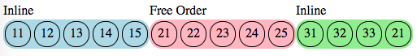

And the following punches, as usual with a few common mistakes to see how it goes:

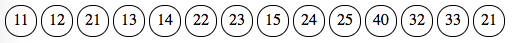

The process involves four steps:

- loose section identification
- split/rejoin punches into sections
- compute traces for each section
- merge traces altogether in a single trace

The first two steps compute section markers, i.e. the indices in the punch list where each section starts and ends. They are a few important constraints to compute valid section markers:

- sections should not overlap each other (meaning a section can not start before the previous section ends)
- a punch always belong to one section (even if not part of section controls) so that consecutive sections are always joined
- a section may be marked as missing (when no punch are judged as belonging to the section, i.e. the section ends before it starts)

Once section markers are computed, the punch sequence is split along markers as subsequence for each section. For each subsequence, the dedicated section tracer (e.g. LCS for inline, Set Difference for free order) can be run and produce an accurate trace in step 3.

Finally, the last step is very simple since it is a merge of all section traces into a single trace.

#### Step 1: Loose Identification of Sections Markers 

This one serves as a kind of initialization/warmup stage for the second step. Overall it reduces the number of iterations in the second step by computing not so naive values for section markers.

The principle is simply to detect all punches whose number match one section control, regardless of its position. Section start marker (resp. end marker) is thus the index of the first (resp. last) marked punch.

For section A, this gives us the following trace: it starts at index 1 with punch 11 and ends at index 8 with punch 15.

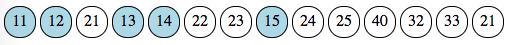

For section B, it starts at index 3 with punch 21 and ends at index 14, again with punch 21.

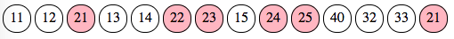

For section C, it starts at index 12 with punch 32 and ends at index 14 with punch 21.

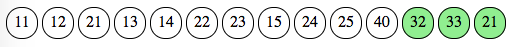

Obviously such simple traces are computed independently of each other. If we put them side by side, we quickly see that they overlap each other, so we can not compute any meaningful trace on them. The second step will take charge of refining section markers so that they are joined but not overlapping.

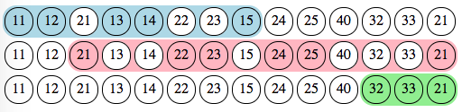

The algorithm is called the "Greedy Loose Tracer" because it computes a trace (for each section) in one pass ("greedy"), contrary to the iterative refinement which happens in second step, yet it makes no attemps at accuracy ("loose"). However, in happy cases, this step will already compute valid section markers, making the second step a no-op.

#### Step 2: Refinement of Section Markers by Split/Rejoin

This steps does the heavy work of refining section markers so that there is no overlap between sections. It works iteratively, section pairs by section pairs, by reducing section markers step by step until there is no overlap - a process called "folding".

Let's start with the first two sections, A and B, for which we have a good overlap from index 3 to index 8. We can count and compare punches for each section in the overlapping part. If there is more of one section, we can tell that this section prevails and that the other section should fold. However, in this case, we have 3 punches for section A (13, 14, and 15) and also 3 for section B (21, 22, 23): the arbitrary rule is that the previous section prevails over the next one.

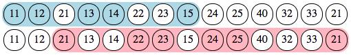

So section B should fold. Since it is the next section in the pair, this means its start index should move to the right, giving up on punch 21. However, it does not move completely to the non-overlapping punch (number 24 at index 9) but to its next marked punch, here number 22 at index 6. Since there is still an overlap, we iterate again with the prevailing criteria.

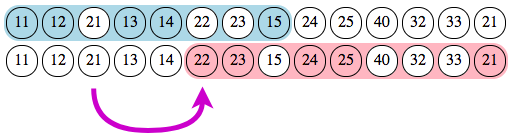

Here we have a clear dominance of section B over A with 2 punches (22, 23) against one (15). So section B prevails and section A folds "to the left", since it is the starting section and its end index should move to the left. The previous marked punch, number 14 at index 5, is thus selected.

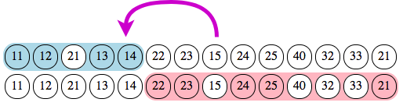

After this second iteration, there is no more overlap between sections A and B. Each punch in this pair belongs to a single section. By folding iteratively, the algorithm tries to maximize the number of own marked punches inside each section. We now move to the next pair, sections B and C.

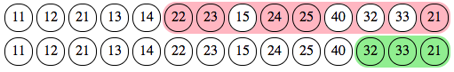

We have an overlap with 3 punches, all belonging to section C, and only one belonging to section B (since punch 21 is marked by both sections). So section C prevails over section B, which should fold to the left. Its new end index is thus 10 with punch 25.

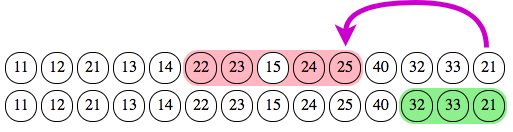

After this iteration, there is no overlap between any section in the sequence. Are we done yet? Not entirely, since we now have an orphan punch, number 40 at index 11, which does not belong to any section. So the final stage in this step is to "rejoin" sections: we simply move end indices of each section so that there is no gap between them.

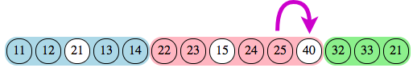

There are a few edge cases which are not described here, dealing with orphan punches and missing sections. Indeed, in the process of folding indices, it can happen we find no more punch for a section, in which case it is deemed missing. The iterative process then must start over with the next or previous section.

After this step we now have valid section markers, with no overlap yet consecutive sections. These markers are used to cut the sequence into subsequences for each section, with each punch belonging to one and only section.

#### Steps 3 & 4: Individual Section Tracing & Merging all Sections Traces

Once we have valid section markers, the third step looks trivial enough since we can run the dedicated tracer for each section. We will run the LCS tracer for inline sections and set difference for free order.

This gives us the following traces, with red marking mispunch and white being added punch.

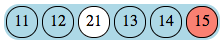

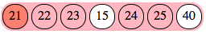

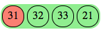

The final step is even more simpler as we merge all individual traces into a single one, which can be used for display and penalties.

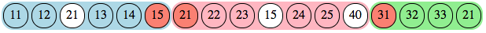

### On Confidence and Accuracy: How Good Is It?

Can we identify such section limits without an accurate algorithm for section checking? It turns out that you can, using some heuristics. Although I must say I am less confident that this heuristics is 100% accurate (i.e. provide the best plausible trace for any given series of punches, even improbable ones).

## Aside: the end of Geco development

- what did work and what didn't
- what would I do differently now?
