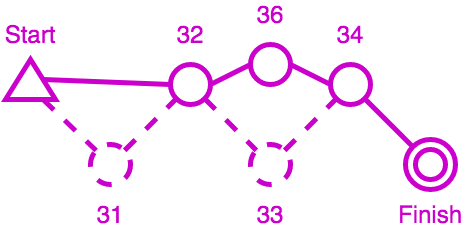

# Punched - Checked - Traced: how Geco Deals with Punches for Orienteering Races

From 2008 to 2015, I spent a lot of my personal time developing Geco, a software to manage orienteering races. What began as an algorithmic challenge for an edge case in a peculiar race (called Orient'Show) for a niche sport, would take up many thoughts as new challenges and features came around.

## A Bit of Backstory: Orient'Show and Geco

In 2006 I was glad to participate in the first ever Orient'Show organized in France, near Lille. If you can picture orienteering, you have a detailed map of the terrain around, with a course drawn on it, and you use your navigation skills to run around and find course controls. In general, you must find controls in order and if you forget/jump one, you are either disqualified or given a time penalty depending on race rule. This is often called a mispunch (MP, missing punch). Orienteering races typically takes place in natural terrain, from 30 minutes to much longer time. Orient'Show (nowadays it is more often called Ultrasprint) is designed as a very short event, with races ranging from 30s to 5 minutes, in multiple rounds, on semi-artificial terrain (including labyrinthic features). Given the high number of controls and the fast pace, runners do not check they punch the right control - they must be confident enough - but they take a time penalty if they mispunch - for example if they take one control for another.

Nowadays electronic punching is common at all orienteering events. Each runner carries a chip which records control number and split time. After the finish one can read the chip and let the software checks whether the runner is OK or MP (mispunched) and computes the final time (including penalties).

## Problem Definition

Take a simple course with a start, four controls, and a finish. The runner must punch the four controls codes 31, 32, 33, 34 in order to be ranked. But he may also punch controls which are not on the course, or he may mispunch by skipping/jumping some. Anyway, this defines the two main inputs for a checking algorithm:

- the list of controls for the course, in order
- the list of punches, as taken in order by the runner

Depending on race rules, we can define three types of output with increasing degrees of precision:

- a binary output OK or MP (Missing Punch), where we don't care about the number of MPs
- the precise number of Missing Punches, because we care about time penalties
- a detailed trace which shows which controls are ok and which one are missing in runner punches - this is often useful to explain their results to runners

In the example above, we can compute the three different outputs as follow:

- checks that control 31 is missing in punches, and stops immediately with MP
- detects that they are two missing controls, and computes time penalties accordingly
- computes a trace which tells that control 31 is missing, control 32 is ok, control 33 is missing and replaced by 36, control 34 is ok

So far this seems very basic with no algorithmic difficulty. But course setters in orienteering like to be creative and with the advance of electronic punching, new course schemas became available: butterfly loop and phi loop.

Basically, this means that some controls can be reused in a course, which create loops in the course design. Loops are used mostly in mass start events to split packs of runners: runner would run loops in different orders but at the end, they would cover the same distance and face the same orienteering choices from control to control so variations in loop order are considered equal.

From the algorithmic point of view, this means that a control number can appear multiple times in a trace. The challenge then is to compute an accurate number of penalties as well as a detailed trace to explain how the runner performs against the course (especially of course when they are missing punches).

Let's take the following punches corresponding to the butterfly course: 32, 31, 33, 31, 34, 35, 31, 36. Notice that before and after each loop, the runner should punch control 31.

Notice that jumping a punch is the simplest case for mispunch. Over the years, race stress can trigger a lot of behaviors: skipping a full loop, taking a loop in reverse, or even taking the wrong map at start (and thus running a completely different course than what is expected).

## Computing penalties and trace for a course with butterfy loops

In computer algorithms, there are a number of metrics which compare two sequences between them to find differences. Edit distances such as [Levenshtein distance](https://en.wikipedia.org/wiki/Levenshtein_distance) compute the number of addition, deletion, or substitution of characters: for example mispunches can be seen as deletion or substitution of controls. The algorithm used by Geco is actually based on the [Longest Common Subsequence Problem](https://en.wikipedia.org/wiki/Longest_common_subsequence_problem). We compute the longest common (non-continuous) subsequence between course controls and runner punches iteratively in a matrix. From this matrix of sequence lengths we can compute two things:

- the number of mispunches, as the difference between the number of course controls and the number of correct punches in the subsequence;
- a trace which explains added and mis punches by backtracking through the matrix.

Here is a sample matrix for the butterfly example above (for the detailed algorithm, see https://github.com/sdenier/Geco/blob/master/src/net/geco/control/checking/InlineTracer.java#L51). The **top row** shows course control ; the **left column** shows runner punches.

|   |  S| 31| 32| 33| 31| 34| 31| 35| 31| 36|
|---|---|---|---|---|---|---|---|---|---|---|
|  S|  0|  0|  0|  0|  0|  0|  0|  0|  0|  0|
| 32|  0|  0|  1|  1|  1|  1|  1|  1|  1|  1|
| 31|  0|  1|  1|  1|  2|  2|  2|  2|  2|  2|
| 33|  0|  1|  1|  2|  2|  2|  2|  2|  2|  2|
| 31|  0|  1|  1|  2|  3|  3|  3|  3|  3|  3|
| 34|  0|  1|  1|  2|  3|  4|  4|  4|  4|  4|
| 35|  0|  1|  1|  2|  3|  4|  4|  5|  5|  5|
| 31|  0|  1|  1|  2|  3|  4|  5|  5|  6|  6|
| 36|  0|  1|  1|  2|  3|  4|  5|  5|  6|  7|

So the length of the longest common subsequence (LCS) is given by the number in the last cell (lower right) in the matrix: here there are 7 controls in common between the course and the punches. Since the course sequence has 9 controls, this gives us 2 mispunches - but which ones? Using the subsequence length computed in each cell, we can backtrack in the matrix to find a correct interpretation (for details, see the backtrack function https://github.com/sdenier/Geco/blob/master/src/net/geco/control/checking/InlineTracer.java#L78)

The idea (starting from the end) is to compare the course control and the punch:
- if they are the same, we can proceed to the previous control and punch, i.e. with the previous cell in diagonal
- if they are different, we must choose which previous cell define the previous LCS between the left one, the top one, or the left-top one (in diagonal); depending on the chosen cell, this implies a mispunch, an added punch, or a substitution (mispunch replaced by an added punch)

Let's follow an example step by step. In the first three steps (from the end), controls and punches match, so we follow the diagonal. This gives us the following trace (built from the last): 35, 31, 36.

On the fourth step in diagonal, expected course control is 34 (column header) but punch is 31 (row header) so this is a mismatch!

Inspecting the surrounding cells (left, top, and top left) allows us to choose the next one: the heuristic tells us to choose the one cell which max the longest common subsequence length.

So in this case, we move to the left cell. This means that we skip course control 31 - in other words, this is a mispunch. We keep punch 34 since it can very well be in the longest common subsequence path. Anyway, this gives us the following trace: -31, 35, 31, 36. -31 is just one way to mark control 31 as missing.

Then on next cell punch 34 matches with control 34 so we can continue along the diagonal, as well as for the next cell. This gives us 31, 34, -31, 35, 31, 36. But on next cell, we have another mismatch with punch 31 ≠ control 32. This time the LCS heuristic tells us to take the top cell (LCS = 1) since it is higher than in diagonal (LCS = 0) and it has priority over the left (LCS = 1) (see https://github.com/sdenier/Geco/blob/master/src/net/geco/control/checking/InlineTracer.java#L78). This means we discard punch 31 for trace validity but we keep looking for control 32 among punches. The trace gives us: +31, 33, 31, 34, -31, 35, 31, 36. +31 indicates this is an added punch, i.e. not counting towards trace validity (even if control 31 appears elsewhere in the course).

On the next cell control and punch 32 match. Then we have no more punches to iterate upon but still one control left in the course. The algorithm must finish in the top left cell (at the start) so we move to the left, which indicates again a mispunch for the given control. Our final trace is then: -31, 32, +31, 33, 31, 34, -31, 35, 31, 36 (this is one of the two edge cases in the algorithm, the other being of course beginning with added punches).

This looks like a simple example yet still shows how the LCS heuristic performs locally to choose a plausible trace.

### Another Example with Substitution

One case which we did not cover in the previous example is when the max LCS shows up in the diagonal cell: this means we have both an added punch in the row and a missing control in the column, which we call a substitution marked -31+32 (for example). In other words, the competitor most likely punches the added control instead of the right one without checking the code. If you want, take your time to dive into the matrix, see how it is built and how to backtrace. What can you tell about it?

|   |  S| 31| 32| 33| 34| 31| 35| 32|
|---|---|---|---|---|---|---|---|---|
|  S|  0|  0|  0|  0|  0|  0|  0|  0|
| 31|  0|  1|  1|  1|  1|  1|  1|  1|
| 35|  0|  1|  1|  1|  1|  1|  2|  2|
| 32|  0|  1|  2|  2|  2|  2|  2|  3|
| 33|  0|  1|  2|  3|  3|  3|  3|  3|
| 34|  0|  1|  2|  3|  4|  4|  4|  4|
| 31|  0|  1|  2|  3|  4|  5|  5|  5|
| 34|  0|  1|  2|  3|  4|  5|  5|  5|
| 32|  0|  1|  2|  3|  4|  5|  5|  6|

If we take a look at the course we have 7 controls but a max LCS length of 6, which implies we have one mispunch. But if we compute the trace we have a much more precise picture: 31,+35,32,33,34,31,-35+34,32.

Can you guess what happened? The course is one combination of a Phi-loop, but it looks like the competitor misses control 35 on the second part of the loop (and took instead control 34 again, which is an example of substitution). But control 35 appears as added as the beginning. This can be understood as the competitor running the Phi-loop in the wrong order. Still, regardless of what really happened in the terrain, the LCS algorithm minimizes the number of mispunches and count only 1 mispunch for this run. This is one of the great force of this algorithm - to expect the best from the competitor, even when he magnificently screws up (which can happen quite often with the stress and fatigue of competition). In this case this could be simply that the runner did not understand in which order to run the Phi-loop, or took a map with the wrong Phi-loop combination for himself. But more strange things can happen in real competition, such as this one time when a competitor took a loop *backwards* during a final stage (this can give the organizer some headscratching/panick attack, because it gives lots of mispunches and added punches but all with the right course controls).

## Next challenge: Courses with multiple sections

- Raid Orient'alpin
- multiple sections, different checking : classic (inline), free order

## Aside: the end of Geco development

- what did work and what didn't
- what would I do differently now?
