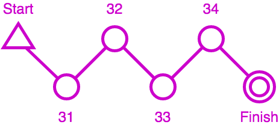
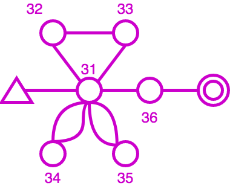

# Punched - Checked - Traced: how Geco Deals with Punches for Orienteering Races

From 2008 to 2015, I spent a lot of my personal time developing Geco, a software to manage orienteering races. What began as an algorithmic challenge for an edge case in a peculiar race (called Orient'Show) for a niche sport, would take up many thoughts as new challenges and features came around.

## A Bit of Backstory: Orient'Show and Geco

In 2006 I was glad to participate in the first ever Orient'Show organized in France, near Lille. If you can picture orienteering, you have a detailed map of the terrain around, with a course drawn on it, and you use your navigation skills to run around and find course controls. In general, you must find controls in order and if you forget/jump one, you are either disqualified or given a time penalty depending on race rule. This is often called a mispunch (MP, missing punch). Orienteering races typically takes place in natural terrain, from 30 minutes to much longer time. Orient'Show (nowadays it is more often called Ultrasprint) is designed as a very short event, with races ranging from 30s to 5 minutes, in multiple rounds, on semi-artificial terrain (including labyrinthic features). Given the high number of controls and the fast pace, runners do not check they punch the right control - they must be confident enough - but they take a time penalty if they mispunch - for example if they take one control for another.

Nowadays electronic punching is common at all orienteering events. Each runner carries a chip which records control number and split time. After the finish one can read the chip and let the software checks whether the runner is OK or MP (mispunched) and computes the final time (including penalties).

## Problem Definition

Take a simple course with a start, four controls, and a finish. The runner must punch the four controls codes 31, 32, 33, 34 in order to be ranked. But he may also punch controls which are not on the course, or he may mispunch by skipping/jumping some. Anyway, this defines the two main inputs for a checking algorithm:

- the list of controls for the course, in order
- the list of punches, as taken in order by the runner

Depending on race rules, we can define three types of output with increasing degrees of precision:

- a binary output OK or MP (Missing Punch), where we don't care about the number of MPs
- the precise number of Missing Punches, because we care about time penalties
- a detailed trace which shows which controls are ok and which one are missing in runner punches - this is often useful to explain their results to runners

In the example above, we can compute the three different outputs as follow:

- checks that control 31 is missing in punches, and stops immediately with MP
- detects that they are two missing controls, and computes time penalties accordingly
- computes a trace which tells that control 31 is missing, control 32 is ok, control 33 is missing and replaced by 36, control 34 is ok

So far this seems very basic with no algorithmic difficulty. But course setters in orienteering like to be creative and with the advance of electronic punching, new course schemas became available: butterfly loop and phi loop.

Basically, this means that some controls can be reused in a course, which create loops in the course design. Loops are used mostly in mass start events to split packs of runners: runner would run loops in different orders but at the end, they would cover the same distance and face the same orienteering choices from control to control so variations in loop order are considered equal.

From the algorithmic point of view, this means that a control number can appear multiple times in a trace. The challenge then is to compute an accurate number of penalties as well as a detailed trace to explain how the runner performs against the course (especially of course when they are missing punches).

Let's take the following punches corresponding to the butterfly course: 32, 31, 33, 31, 34, 35, 31, 36. Notice that before and after each loop, the runner should punch control 31.

Notice that jumping a punch is the simplest case for mispunch. Over the years, race stress can trigger a lot of behaviors: skipping a full loop, taking a loop in reverse, or even taking the wrong map at start (and thus running a completely different course than what is expected).

## Computing penalties and trace for a course with butterfy loops

- Adaptation of Levenshtein algorithm + traceback

## Next challenge: Courses with multiple sections

- Raid Orient'alpin
- multiple sections, different checking : classic (inline), free order

## Aside: the end of Geco development

- what did work and what didn't
- what would I do differently now?
