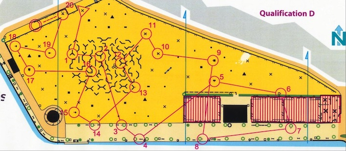
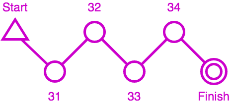
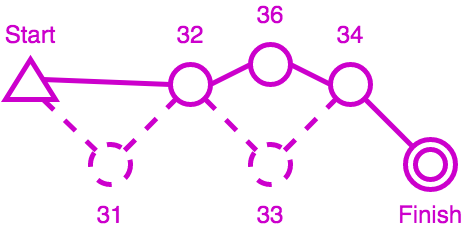
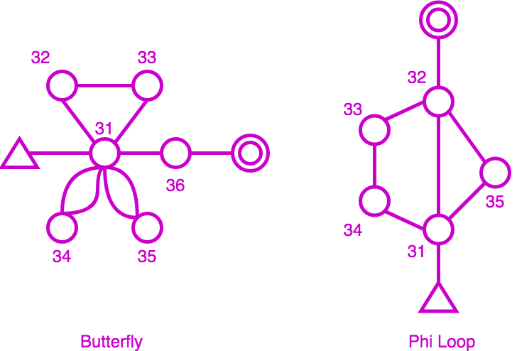
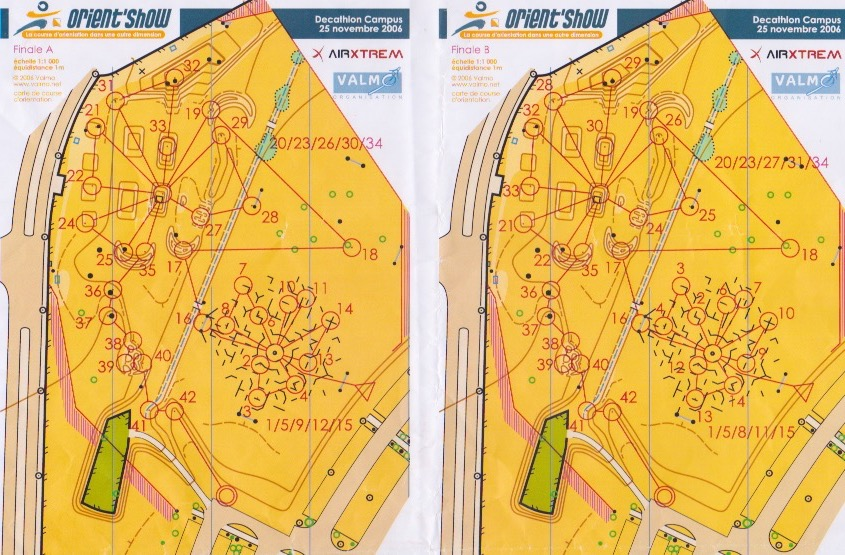
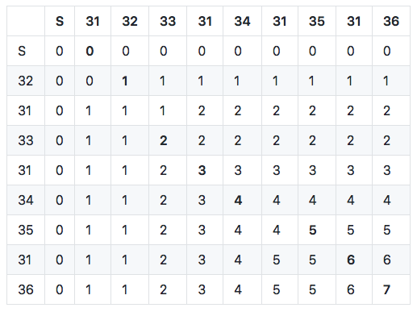
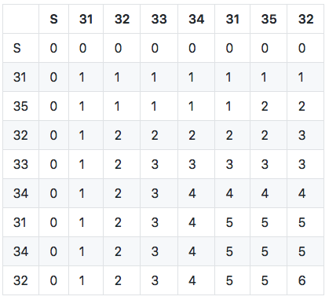
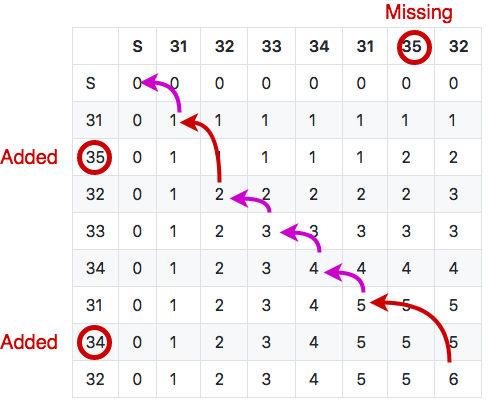
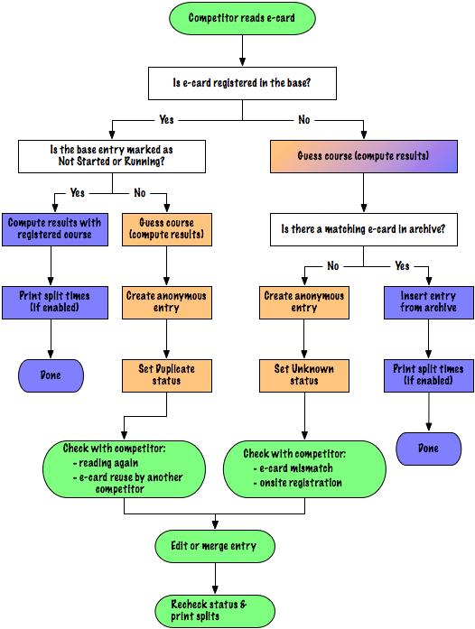

# Punched - Checked - Traced: Computing Accurate Traces for Orienteering Events (1)

*This is a two-part series about algorithms for orienteering events. There were a crucial focus of [Geco](http://sdenier.github.io/Geco/begin/index.html), a software I wrote from 2008 to 2015. You can find the [second part about multi-sections here](./geco_algorithms_2.md).*

## Backstory: Punch Checking, Orient'Show, and a Starting Point for Geco

If you can picture the [orienteering sport](https://www.youtube.com/watch?v=26Zc5AVkFis), you get a detailed map of the terrain, with a course drawn on it, and you use your navigation skills to run around and find course controls. In general, you must find controls in order and if you forget one, you are typically disqualified. This is often called a mispunch (MP, missing punch). Checking that each runner has correctly punched course controls is a crucial part for any organizer and nowadays, electronic punching and control checking software are common in any event.

  
*The map above shows a typical Orient'Show course, using maze and artificial features in a city park. Given the number of features, many courses can be drawn and run on the same map. Orient'Show event in Annecy, World Cup 2010.*

In 2006 I was glad to participate in the first ever Orient'Show organized in France. Orient'Show (called [Ultrasprint on Wikipedia](https://en.wikipedia.org/wiki/Orienteering#Ultrasprint)) is designed as a very short orienteering event on semi-artificial terrain (including maze features). Given the high number of controls and the fast pace, runners do not check they punch the right control - they must be confident enough - but they take a time penalty if they mispunch - for example if they take one control for another.

It appeared that classic orienteering softwares could not compute accurate time penalties for Orient'Show format, which heavily impact results. Soon I was interested in solving this algorithmic challenge and the solution became a starting point (and one of the driving force) for developing [Geco](http://sdenier.github.io/Geco/begin/index.html), which I envisioned as a new take on software for orienteering events. But let's first review the problem in details.

## A Brief on Orienteering Course Design and Checking

Take this simple course with a start, four controls, and a finish. The runner must punch the four controls codes 31, 32, 33, 34 in order. But he may also punch controls which are not on the course, or he may mispunch by skipping some. Anyway, this defines the two main inputs for a checking algorithm:

- the list of controls for the course, in order,
- the list of punches, as taken in order by the runner.

We can define three types of output with increasing degrees of precision:

- a binary output OK or MP (Missing Punch), where we don't care about the number of MPs (this is good enough for basic results in classic orienteering format),
- the precise number of missing punches, because we care about time penalties,
- a detailed trace which shows which controls are ok and which one are missing in runner punches - this is often useful to explain their results to runners.

In the example above, we can compute the three different outputs as follow:

- checks that control 31 is missing in punches, and stops immediately with an MP output;
- detects that they are two missing controls, and computes time penalties accordingly;
- computes a trace which tells that control 31 is missing, control 32 is ok, control 33 is missing and replaced by 36, control 34 is ok.

So far this seems very basic with no algorithmic difficulty. But course setters in orienteering like to be creative and with the advance of electronic punching, new course schemas became available: butterfly loop and Phi loop.

  
*Butterfly course with 3 loops over control 31, with up to 6 combinations - After each loop the competitor must come back and punch central control 31. Phi loop course with 2 possible combinations, either 31 directly to 32 then the full circle 33, 34, back to 31, 35, 32, or 31 to 35, 32, 33, 34, back to 31, then to 32.*

Basically, this means that some controls can be reused in a course, which create loops in the course design. Loops are used mostly in mass start events to split pack of runners: competitors would run loops in different orders but at the end, they would cover the same distance and face the same orienteering choices from control to control so variations in loop order are considered equal.

  
*A bit more involved example from the Orient'show 2006 final. The course had two butterflies with four loops each (since the final had 4 competitors running at the same time). Take a look to see how each runner has different configurations in their loop order.*

From the algorithmic point of view, this means that a control number can appear multiple times in a trace. The challenge then is to compute an accurate number of penalties as well as a detailed trace to explain how the runner performs against the course (especially of course when they are missing punches) - this is where classic event softwares fail, because they are disturbed when the competitor misses the central control at least one time: he has both missed and taken it. 

> Notice that skipping a control is the simplest case for mispunch. Over the years, I have seen competition stress trigger a lot of strange behaviors: skipping a full loop, taking a loop in reverse, or taking the wrong map at start (and thus running a completely different course than what is expected).

## The LCS/Backtrack Algorithm: Computing an Accurate Trace for a Course with Repeating Controls

If we take a look back at our inputs, we have two sequences of codes: one for the course controls and one for the competitor punches. In the field of computer algorithms, there are a number of metrics which compare two sequences between them to find differences. Edit distances such as [Levenshtein distance](https://en.wikipedia.org/wiki/Levenshtein_distance) compute the number of addition, deletion, or substitution of characters: for example mispunches can be counted as deletion or substitution of controls. The algorithm used by Geco is actually based on the [Longest Common Subsequence Problem](https://en.wikipedia.org/wiki/Longest_common_subsequence_problem). We compute the longest common (non-continuous) subsequence between course controls and runner punches iteratively in a matrix. From this matrix of sequence lengths we can deduce two things:

- the number of mispunches, as the difference between the number of course controls and the number of correct punches in the subsequence (i.e. the length of the longest common subsequence);
- a trace which explains added punches and mispunches by backtracking through the matrix.

Let's take the following sequences of punches corresponding to the butterfly course: 32, 31, 33, 31, 34, 35, 31, 36. Remember that before and after each loop, the runner should have punched control 31. Here is the matrix for this sample (you can find the [detailed algorithm here](https://github.com/sdenier/Geco/blob/master/src/net/geco/control/checking/InlineTracer.java#L45)).

  
*LCS matrix for the running example with a butterfly course. The **top row** shows course control; the **left column** shows runner punches.*

The length of the longest common subsequence (LCS) is given by the number in the last cell (lower right) in the matrix: here we can see that 7 controls are common between the course and the punches. Since the course sequence has 9 controls, this gives us 2 mispunches - but which ones? Using the subsequence length computed in each cell, we can browse the matrix to find a correct interpretation.

The idea is to backtrack through the matrix (i.e. to start from the end) and at each cell to compare course control and punch code (for details, see the [backtrace function](https://github.com/sdenier/Geco/blob/master/src/net/geco/control/checking/InlineTracer.java#L78)):
- if they are the same, we can proceed to the previous control and punch, i.e. with the previous cell in diagonal;
- if they are different, we must choose which previous cell define the previous LCS between the left one, the top one, or the left-top one (in diagonal); depending on the chosen cell, this implies a mispunch, an added punch, or a substitution (mispunch replaced by an added punch).

Let's follow an example step by step. In the first three steps (from the end), controls and punches match, so we follow the diagonal. This gives us the following trace (built from the last): 35, 31, 36.

On the fourth step in diagonal, expected course control is 31 (column header) but punch is 34 (row header) so this is a mismatch!

Inspecting the surrounding cells (left, top, and top left) allows us to choose the next one: the heuristic tells us to choose the one cell which maximizes the longest common subsequence length.

So in this case, we move to the left cell. This means that we skip course control 31 - in other words, this is a mispunch. We keep punch 34 since it can very well be in the longest common subsequence path. Anyway, this gives us the following trace: -31, 35, 31, 36. -31 is just one way to mark control 31 as missing.

Then on next cell punch 34 matches with control 34 so we can continue along the diagonal, as well as for the next cell. This gives us 31, 34, -31, 35, 31, 36. But on the next one, we have another mismatch with punch 31 ≠ control 32. This time the LCS heuristic tells us to take the top cell (LCS = 1) since it is higher than in diagonal (LCS = 0) and it has priority over the left (LCS = 1) (see the [heuristics](https://github.com/sdenier/Geco/blob/master/src/net/geco/control/checking/InlineTracer.java#L88)). This means we discard punch 31 but we keep looking for control 32. The trace gives us: +31, 33, 31, 34, -31, 35, 31, 36. +31 indicates this is an added punch, i.e. not counting towards trace validity (even if control 31 appears elsewhere in the course).

On the next cell, control and punch 32 match. Then we have no more punch to iterate upon but still one control left in the course. The algorithm must finish in the top left cell (at the start) so we move to the left, which indicates again a mispunch for the given control. Our final trace is then: -31, 32, +31, 33, 31, 34, -31, 35, 31, 36 (this is one of the two edge cases in the algorithm, the other being of course beginning with added punches).

This looks like a simple example yet still shows how the LCS heuristic performs locally to choose a plausible trace.

## Another Example, with Substitution

One case which we did not cover in the previous example is when the max LCS shows up in the diagonal cell: this means we have both an added punch in the row and a missing control in the column, which we call a substitution, marked for example -31+32. In other words, the competitor most likely punches the added control instead of the right one without checking the code.

If you want, take your time to dive into the matrix below, see how it is built and how to backtrace. What can you tell about it?

If we take a look at the course we have 7 controls but a max LCS length of 6, which implies we have one mispunch. If we backtrack through the matrix to compute the trace, we have a much more precise picture: 31, +35, 32, 33, 34, 31, -35+34, 32.

Can you guess what happened? The course is one combination of a Phi loop, but it looks like the competitor misses control 35 on the second part of the loop (and took instead control 34 again, which is an example of substitution). But control 35 appears as added as the beginning. This can be understood as the competitor running the Phi loop in the wrong order. Still, regardless of what really happened in the terrain, the LCS algorithm minimizes the number of mispunches and count only 1 mispunch for this run.

This is one of the great force of this algorithm - to expect the best from the competitor, even when he magnificently screws up. In this case this could be simply that the runner did not understand in which order to run the Phi loop, or took a map with the wrong Phi loop combination for himself. But more strange things can happen in real competition, such as this one time when a competitor took a loop *backwards* during a final stage: this can give the organizer some headscratching/panick attack, because it gives lots of mispunches and added punches but all with the right course controls.

## New Feature Unlocked: Automatic Course Detection

The fun thing when you have a trustful algorithm is that you can start to build new features and workflow on top of it. For Geco such a feature became known as automatic detection of course for any competitor.

Classically one would need a list of competitors and their chosen course to be registered in the system before the race, so that the algorithm can check punches against the competitor course. But if you check punches for each course of the race, the algorithm can compute the number of mispunches for each. In good faith, you can then [select the one with the less mispunches](https://github.com/sdenier/Geco/blob/master/src/net/geco/control/ecardmodes/CourseDetector.java#L121) as the most likely course ran by the competitor. Best case (and most likely) is that you find one course with 0 mispunch, because the competitor just performed nominally.

Besides the algorithmic fun, the best thing is that you can reinvent/simplify the organization process. Instead of a full pre-registration effort, you can just go with minimal setup (courses configuration is the bare minimum in this case) and just let things happen once competitors come back from their race. An archive of known competitors can help to fill in identity details when punches are read from their electronic card. In Geco, this was embodied in the [Automatic process](http://sdenier.github.io/Geco/workflows/auto.html) and was actually used in race from dozens to hundreds of competitors.

As exemplified by the figure, the real process is a bit more involved as it handles edge cases such as anonymous card or duplicate reading.

## Next Step: Checking Multiple Sections

The LCS algorithm became the backbone for Geco initial development and ongoing features. However, a few years later, I had the occasion to tackle a new challenge with multi-sections courses. This is the subject of the [second part](./geco_algorithms_2.md) of this Geco series.
