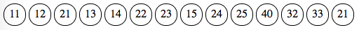
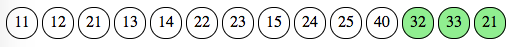
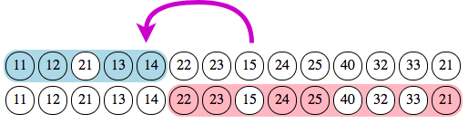
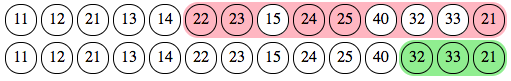
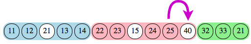
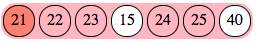
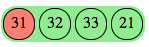
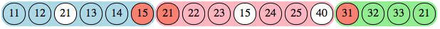

# Punched - Checked - Traced: Computing Accurate Traces for Orienteering Events (2)

*This is a two-part series about algorithms for orienteering events. There were a crucial focus of [Geco](http://sdenier.github.io/Geco/begin/index.html), a software I wrote from 2008 to 2015. You can find the [first part here](./geco_algorithms_1.md).*

## The Next Step: Courses with Multiple Sections (Adventure Racing)

The one thing some organisers love the most is inventing new race format, especially in [adventure racing](https://en.wikipedia.org/wiki/Adventure_racing). They usually comprise multiple sections with different sports (running, biking, paddling, ...), and for some sections (if not all), competitors must make their own route choice and navigate by themselves. Of course the organizers set up checkpoints so that competitors prove their passing, as in an orienteering event.

As one uses electronic punching to check such race results, one must take into account the rules. For example my club has long organized the [Raid Orient'Alpin](https://orientalp.fr/raidorientalpin/): it comprises in general half a dozen sections, where each section can be seen as a single course with its own controls. But while most sections should be run "inline" (meaning controls must be taken in a specific order), some might be run in "free order" (meaning competitors can choose the order in which to take controls, adding some tactical challenge and helping to scatter teams across the map).

  
*Among the seven sections, sections 3 and 7 shall be run in free order. By default, all others are run inline.*

From an organisational point of view, it would be impractical to stop competitors after each section, read their electronic card to check punches, then reset it for the next section. So what you usually have is a unique read station after the race, where competitors read their one card with all punches from all sections. It is up to you to figure out whether they have mispunches or not, and in case of mispunch which control, so that you can apply the right time penalty depending on the section. Of course, it is often the case that the course contains loops, meaning a control number might appear multiple times in the course. Given race length and physical hardness, it is also often the case that competitors mispunch by error or simply drop some controls due to tiredness - so as an organizer you can see many strange things happening in the trace.

To sum up inputs and requirements, we have:

- a course organized in many sections (i.e. many subcourses/sections organized in a single course) and possibly repeating control numbers
- for each competitor, a single collection of punches, which contain data from all successive sections
- the need for an accurate trace with mispunches to compute time penalties
- sections with different checking rules, inline or free order
- as a bonus, competitors love to have section times, i.e. the time spent for each section, to compare where they win or lose time

The first three points are actually no different than what we have seen for the Orient'Show format. So the [LCS/Backtrack algorithm](./geco_algorithms_1.md) seems perfect for that. However the hiccup comes from the last two, especially the free order rule. Free order implies a different checking rule, which although much simpler (a [Set difference](https://mathworld.wolfram.com/SetDifference.html)), can not be fulfilled by LCS which expects a sequence (as implied by its name).

The intuition which comes to mind is to perform some [Divide-and-Conquer](https://en.wikipedia.org/wiki/Divide-and-conquer_algorithm) approach, meaning identifying a subsequence of punches for each section, then running the specific checking algorithm for each section (LCS or Set Difference). In other words, we want to cut the whole sequence of punches into subsequences, and for that we must identify probable section limits first.

I have long doubted whether it was even feasible/possible to compute an accurate trace (i.e. which makes sense for the competitor and provide best results) for such a case, without resorting to some kind of training/learning process (e.g. some Bayesian network). But apart from the fact that I am not a strong specialist of probabilist tricks, I was at unease that it was not deterministic - and I wanted something which would give the same results whether it was the first time it performs or whether I had hundreds of trace to compare to.

## Multi-Sections Checking: an Annotated Example

Now that we have passed the problem exposition, let's dive into a concrete example to see the [solution as implemented in Geco](https://github.com/sdenier/Geco/blob/master/src/net/geco/control/checking/SectionsTracer.java#L45). We will take the following course definition which involves three sections: first (blue controls) and last (green) are inline, second (red) is a free order. Notice that control 21 appears both in section 2 and section 3.

And the following punches, as usual with a few common mistakes to see how it goes:

The process involves four steps:

1. loose (potentially invalid) identification of punches for each section
1. refinement (if need be) of punch subsequence for each section
1. computing detailed trace for each section
1. merge traces altogether in a single trace

The first two steps compute section markers, i.e. the indices in the punch list where each section starts and ends. They are a few important constraints to compute valid section markers:

- sections should not overlap each other (meaning a section can not start before the previous section ends)
- a punch always belong to one section (even if not part of section controls) so that consecutive sections are always joined
- a section may be marked as missing (when no punch are judged as belonging to the section, i.e. the section ends before it starts)

Once section markers are computed, the punch sequence is split along markers as subsequence for each section. For each subsequence, the dedicated section tracer (e.g. LCS for inline, Set Difference for free order) can be run and produce an accurate trace in step 3. Finally, the last step is very simple since it is a merge of all section traces into a single trace.

### Step 1: Loose Identification of Sections Markers 

This one serves as [initialization/warmup stage](https://github.com/sdenier/Geco/blob/master/src/net/geco/control/checking/SectionsTracer.java#L52) for the second step. Overall it reduces the number of iterations in the second step by computing not so naive values for section markers.

The principle is simply to detect all punches whose number match one section control, regardless of its position. Section start marker (resp. end marker) is thus the index of the first (resp. last) marked punch.

For section A, this gives us the following trace: it starts at index 1 with punch 11 and ends at index 8 with punch 15.

For section B, it starts at index 3 with punch 21 and ends at index 14, again with punch 21.

For section C, it starts at index 12 with punch 32 and ends at index 14 with punch 21.

Obviously such simple traces are computed independently of each other. If we put them side by side, we quickly see that they overlap each other, so we can not compute any meaningful trace on them. The second step will take charge of refining section markers so that they are joined but not overlapping.

The algorithm is called the ["Greedy Loose Tracer"](https://github.com/sdenier/Geco/blob/master/src/net/geco/control/checking/GreedyLooseTracer.java) because it computes a trace (for each section) in one pass ("greedy"), contrary to the iterative refinement which happens in second step, yet it makes no attemps at accuracy ("loose"). However, in happy cases, this step will already compute valid section markers, so that the second step becomes unnecessary.

### Step 2: Refinement of Section Markers by Split/Rejoin Algorithms

This steps does the heavy work of [refining section markers](https://github.com/sdenier/Geco/blob/master/src/net/geco/control/checking/SectionsTracer.java#L90) so that there is no overlap between sections. It works iteratively, sections pair by sections pair, by reducing section markers step by step until there is no overlap - a process called "folding" in the algorithm.

Let's start with the first two sections, A and B, for which we have a good overlap from index 3 to index 8. We can count and compare marked punches for each section in the overlapping part. If there is more of one section, we can tell that **this section prevails** and that the **other section should fold**. However, in this case, we have 3 punches for section A (13, 14, and 15) and also 3 for section B (21, 22, 23): the arbitrary rule is that the [previous section prevails over the next one](https://github.com/sdenier/Geco/blob/master/src/net/geco/control/checking/SectionsTracer.java#L267).

So section B should fold. Since it is the next section in the pair, this means its start index should move to the right, giving up on punch 21. However, it does not move completely to the non-overlapping punch (number 24 at index 9) but to its next marked punch, here number 22 at index 6. Since there is still an overlap, we iterate again with the prevailing criteria.

Here we have a clear dominance of section B over A with 2 punches (22, 23) against one (15). So section B prevails and section A folds "to the left", since it is the starting section and its end index should move to the left. The previous marked punch, number 14 at index 5, is thus selected.

After this second iteration, there is no more overlap between sections A and B. Each punch in this pair belongs to a single section. By folding iteratively, the algorithm tries to maximize the number of own marked punches inside each section. We now move to the next pair, sections B and C.

We have an overlap with 3 punches, all belonging to section C, and only one belonging to section B (since punch 21 is marked by both sections). So section C prevails over section B, which should fold to the left. Its new end index is thus 10 with punch 25.

After this iteration, there is no overlap between any section in the sequence. Are we done yet? Not entirely, since we now have an orphan punch, number 40 at index 11, which does not belong to any section. So the final stage in this step is to ["rejoin" sections](https://github.com/sdenier/Geco/blob/master/src/net/geco/control/checking/SectionsTracer.java#L155): we simply move the end index of each section so that there is no gap between them.

There are a few edge cases which are not described here, dealing with orphan punches and missing sections. Indeed, in the process of folding indices, it can happen we find no more punch for a section, in which case it is deemed missing. The iterative process then must start over with the next or previous section.

After this step we now have valid section markers, with no overlap yet joined sections. These markers are used to cut the sequence into subsequences for each section, with **each punch belonging to one and only one section**.

### Steps 3 & 4: Individual Section Tracing & Merging all Sections Traces

Once we have valid section markers, the third step looks trivial enough since we can run the [dedicated tracer for each section](https://github.com/sdenier/Geco/blob/master/src/net/geco/control/checking/SectionsTracer.java#L62). We will run the LCS tracer for inline sections and set difference for free order.

This gives us the following traces, with red marking mispunch and white being added punch.

The final step is even more simpler as we [merge all individual traces into a single one](https://github.com/sdenier/Geco/blob/master/src/net/geco/control/checking/SectionsTracer.java#L75), which can be used for display and penalties.

## On Confidence and Accuracy: How Good Is It?

The algorithm has been used multiple times in real events, with good results. However, given the multiplicity of steps and overall complexity, it is difficult to detect edge cases and assess its accuracy (i.e. whether it can provide the best plausible trace for any given series of punches, for any course). I have seen one edge case, with a peculiar course configuration, where a mispunch at a specific position would trigger a "wrong fold" in the second step and thus shifts section markers a few index off. That is why it is possible in Geco to [manually update section markers](http://sdenier.github.io/Geco/workflows/multisections.html#manual-modifications-for-a-multi-sections), if the event administrator feels they are a bit offtrack.

## A Parting Word

We have now covered a strong part of the algorithmic technicalities in Geco. However, in good Pareto spirit, this is far from representing the main development effort. A huge aspect of Geco design was in fact to provide a simple experience for the event administrator. If most of the time all goes well, the organizer must react quickly when a "bug" appears in the event flow: even a simple mispunch in a competitor trace can be the clue for a bigger problem, such as an incorrectly setup or badly positioned control station. That is where good automation and good UX can help, by lightening the mental load for the organizer, helping him to focus on ongoing issues. Apart from that, it's all fun when you just have to sit down behind Geco and enjoy competitors reading their card and discussing their race.
