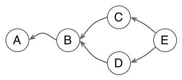

# Git in 10 Minutes: 3 Concepts to Understand the Git Model and Do Everything with It

Git has a reputation for being a geeky tool with a steep learning curve, including a <abbr title="Command Line Interface">CLI</abbr> with lots of options, and more concepts (staging, remote, push/pull, ...) to start with than classic revision control tools.

But Git has actually a simple conceptual model and does not attempt to hide it as implementation details. Learning this model and how Git operates on it will greatly speed up your apprenticeship of the tool. In other words, you will start to think like Git, and then finding or mixing commands will become much easier, with the occasional dive into the online help to get the right option.

To begin with your apprenticeship of the Git model, you just need the concepts of snapshots, graph, and changesets.

> If you are already used to other revision tools but think Git is too hard to learn for your needs, then continue reading, you might be surprised! However, if you have never used a revision tool before, why not [try Git] (https://try.Github.io/levels/1/challenges/1) first? Come back when you have played with the basic commands but want a better grasp about what is going on.

## Git Stores Snapshots (aka Commits) of your Project

We start with an easy one. A commit is snapshot of all files in your project, starting from the root. In other words, it is a copy of all tracked files at the time of creating the commit.

The reason it starts from the project root folder is that you should save a consistent version of your project, including related changes across all subfolders (and not forgetting one in the process).

With this guarantee, we can be sure that checking out a commit will give us that exact state we saved, be it a release version, a buggy one which needs a fix, or a work in progress.


*Commit A points to a snapshot of all project files. Even if you only change the foo file to create a version v3 in commit A, Git will remember that you want zorg in version 1 and bar in version 2 for this snapshot.*

## Git Represents Relationships between Commits (aka History) as a Graph

In any revision control system, commits do not exist in isolation but are linked through a parent-child relationship, which remembers where a commit comes from (what was the previous state before the commit).


So you can start to view the history of your project as a line of successive states. The above figure presents a common representation of history in a Git repository, where the arrow indicates that commit B **knows** that its parent is commit A (in Git, parent commits do not know about their children, so the arrow points "backward"). In the same manner, commit C knows its parent B, and by transitivity its grandparent A...


When two commits share the same parent, you start to have divergent branches. Each line can continue to grow in concurrent ways.


When time has come to merge two branches together, Git creates a commit with two parents. The result is that the history is now a directed graph of commits.

The concept of graph to represent the history of a project seems like pretty intuitive, even an obvious choice. You might be surprised by the fact that not all revision control tools use a graph as a first class representation. For example, Subversion works with independent directory-trees to represent branches and only stores branch/merge as meta-data: the lack of a full graph representation leads to some problematic merge cases.

But more importantly, the history graph allows us to compute the difference between any two states - which leads us to the next concept: changeset.

## Git Can Compute Changes between any Two Commits of your Project

When you create a commit B from commit A, you create a new snapshot. But you can also see it as an incremental evolution upon the previous commit. This contribution brought by the commit makes a group of indivisible changes, which is called a changeset.


*A snapshot stores the full state, independent of history. A changeset only records what has changed.*

### What Is in a Changeset? And What to Do With It?

The interesting bit about changesets is that they can be used as blueprint to copy the changes brought by B elsewhere. This is possible because a changeset can be generated to contain just enough information about the transformation.


*Changeset will only modify files bar and zorg from commit F. It does not care that foo file from B is absent from F or that there is a yyy file.*

Git, for example, see changes at the level of lines in text files. When you view a patch in Git (which is the textual representation of a changeset), you see something like that:

    diff --git a/git_in_10_minutes.md b/git_in_10_minutes.md
    index 08f09c4..95b778a 100644
    --- a/git_in_10_minutes.md
    +++ b/git_in_10_minutes.md
    @@ -18,7 +18,17 @@ With this guarantee, we can be sure that checking out a commit will give us that exact state we saved, be it a release version, a buggy one which needs a fix, or a work in progress. 

    -## Git Stores Relationships between Commits (aka History) as a Graph
    +## Git Represents Relationships between Commits (aka History) as a Graph
    +
    ## Git Can Compute Changes between any Two Commits of your Project

To see this in action, just run ```git diff HEAD HEAD~1``` in a repository. It will show you the changes between your latest commit and the previous one, directly in patch format.

A patch file will register the following information:

- which file is impacted by the change
- at which lines start the next change section
- *unchanged* context lines before the changes
- lines removed by the change, prefixed by *-*
- lines added by the change, prefixed by *+* (changed line are removed then added)
- *unchanged* context lines after the changes
- and so on for all sections and all files in the changeset

Git needs only to match the target files, line positions and textual context to make the changes described by the patch. In other words, it does not care about files from the snapshot which are untouched by changes. Even more, it does not care if other sections of the file have changed too. So it is easy for Git to copy changes from a commit on top of a different snapshot, provided context has not changed too much (otherwise, Git will detect and notify conflicts).

### Changesets Anytime Anywhere

Things start to become interesting when you know that Git can compute changesets (and patch files) on the fly between any two states of your project. That means not only how to transform commit A into its child commit B, but also:

- the transformation from any ancestor of B to B itself
- the transformation from branch X to a parallel branch Y
- or, why not, the reverse transformation from B to its parent A or an ancestor (to cancel a change for example)

In other words, Git is super effective in computing state transformations and applying such transformations elsewhere (well, All RCS are the same, but some are more effective than others).

## Git Commands in Action

Now that we know how Git can use changesets, we can start to think like Git and see how its commands operate on your project.

### Updating the Working Copy (Switching between Branches, Pulling)

When you switch to another branch, or update your current branch, you change your local working copy. But the working copy actually mirrors your latest commit in HEAD (minus local modifications). Which means that Git can compute the difference between your HEAD and any given commit, then apply the transformation to update your working copy.

Think about it: to change your working copy, Git could simply wipe out previous files and dump fresh new files. But for big projects with thousands of files, this would be way too costly. Instead it patches local files, which means it only changes what needs to be updated to mirror the new state.

There is an added benefit with this strategy. Have you noticed that you can switch to a different branch without losing local modifications? That is because Git will leave such files untouched if it does not need to patch them. This comes in handy when you start to fix something in your current branch, then realize it would be better to do it in another existing branch before committing.

But what happens if Git must patch a file section which already has local changes? It will just forbid the action, otherwise you would lose your changes since Git would have overwritten them before they are versionned.

### Cherry-picking

You make a cherry-pick when you want to retrieve in your current branch some commits and changes from another branch, but do not want to retrieve all changes from this branch. It is typically used for bug fix or small chores, when you really need this one atomic change but can not afford to merge a branch.

Cherry-picking really embodies the whole changeset/patch everywhere principle:

1. you ask Git to cherry-pick a commit (or a series of commits)
2. Git computes the changeset for the given commit
3. Git tries to apply the changeset in the context of your current branch
4. If it succeeds, it will create a new commit with the content and the metadata of the source commit (author, message, original timestamp)
5. It if fails because the context has changed, it will produce a conflict, which you can resolve.

### Rebasing

Rebasing (be it a batch rebase or an interactive one) is not much more complicated once you understand cherry-pick. Basically, for a rebase, Git computes changesets for each commit you want to move, pushes them in a stack (from last to first) ; then it pops each changeset from the stack to apply it in the same order they appear in history, effectively reproducing this history elsewhere.

The big difference is how you move/copy things around, and for the interactive rebase the actions you can perform on commits during the process.

cherry-pick, you copy from history to current head
rebase, you move some commits from current head to a different location


About recurrent conflicts?

### Merging

## Advanced: what about Conflicts?

http://codicesoftware.blogspot.com/2011/09/merge-recursive-strategy.html

## Conclusion

A bit more to learn (like how Git manages branches and tags as labels on the graph, how commits are actually immutable, and what happens with new/discarded commits, Git fetch/push/pull)
