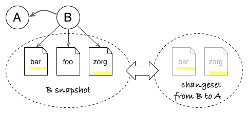
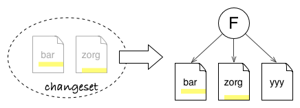
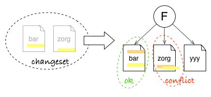
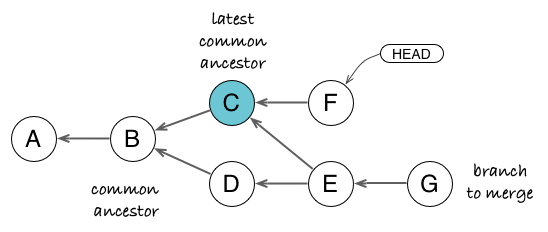
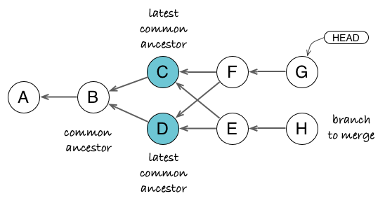

# Git in 10 Minutes: 3 Concepts to Understand the Git Model and Do Everything with It

Git has a reputation for being a geeky tool with a steep learning curve, including a <abbr title="Command Line Interface">CLI</abbr> with lots of options, and more concepts (staging, remote, push/pull, ...) to start with than classic revision control tools.

But Git has actually a simple conceptual model and does not attempt to hide it as implementation details. Learning this model and how Git operates on it will greatly speed up your apprenticeship of the tool. In other words, you will start to think like Git, and then finding or mixing commands will become much easier, with the occasional dive into the online help to get the right option.

To begin with your apprenticeship of the Git model, you just need the concepts of snapshots, graph, and changesets.

> If you have already used other revision tools but think Git is too hard to learn for your needs, this article is for you! However, if you have never used a revision tool before, why not [try Git] (https://try.Github.io/levels/1/challenges/1) first? Come back when you have played with the basic commands but want a better grasp about what is going on.

## Git Stores Snapshots (aka Commits) of your Project

We start with an easy one. A commit is snapshot of all files in your project, starting from the root. In other words, it is a copy of all tracked files at the time of creating the commit.

The reason it starts from the project root folder is that you should save a consistent version of your project, including related changes across all subfolders (and not forgetting one in the process).

With this guarantee, we can be sure that checking out a commit will give us that exact state we saved, be it a release version, a buggy one which needs a fix, or a work in progress.


*Commit A points to a snapshot of all project files. Even if you only change the foo file to create a version v3 in commit A, Git will remember that you want zorg in version 1 and bar in version 2 for this snapshot.*

## Git Represents Relationships between Commits (aka History) as a Graph

In any revision control system, commits do not exist in isolation but are linked through a parent-child relationship, which remembers where a commit comes from (what was the previous state before the commit).


So you can start to view the history of your project as a line of successive states. The above figure presents a common representation of history in a Git repository, where the arrow indicates that commit B **knows** that its parent is commit A (in Git, parent commits do not know about their children, so the arrow points "backward"). In the same manner, commit C knows its parent B, and by transitivity its grandparent A...


When two commits share the same parent, you start to have divergent branches. Each line can continue to grow in concurrent ways.


When time has come to merge two branches together, Git creates a commit with two parents. The result is that the history is now a directed graph of commits.

The concept of graph to represent the history of a project seems like pretty intuitive, even an obvious choice. You might be surprised by the fact that not all revision control tools use a graph as a first class representation. For example, Subversion works with independent directory-trees to represent branches and only stores branch/merge as meta-data: the lack of a full graph representation makes it difficult to follow merge history in SVN.

But more importantly, the history graph allows us to compute the difference between any two states - which leads us to the next concept: changeset.

## Git Can Compute Changes between any Two Commits of your Project

When you create a commit B from commit A, you create a new snapshot. But you can also see it as an incremental evolution upon the previous commit. This contribution brought by the commit makes a group of indivisible changes, which is called a changeset.


*A snapshot stores the full state, independent of history. A changeset only records what has changed.*

### What Is in a Changeset? And What to Do With It?

The interesting bit about changesets is that they can be used as blueprint to copy the changes brought by B elsewhere. This is possible because a changeset contain just enough information about the transformation.


*Changeset will only modify files bar and zorg from commit F. It does not care that foo file from B is absent or that there is a yyy file.*

Git, for example, see changes at the level of lines in text files. When you view a patch in Git (which is the textual representation of a changeset), you see something like that:

    diff --git a/app/scripts/Results.js b/app/scripts/Results.js
    index 98d5f30..ade6329 100644
    --- a/app/scripts/Results.js
    +++ b/app/scripts/Results.js
    @@ -8,18 +8,20 @@ angular.module('golive')
     
    -    var polling;
    +    var previousStatus = dataSource.status,
    +        polling;
     
         function pollData() {
    -      var previousStatus = dataSource.status;
           dataSource.status = 'polling';
           return $http.get(dataSource.url).success(function(data) {
             stage.name = data.name;
             dataSource.status = previousStatus;
    +      }).error(function() {
    +        dataSource.status = 'error';
           });
         }

To see this in action, just run ```git diff HEAD~1 HEAD``` in a repository. It will show you the changes between your latest commit and the previous one, directly in patch format.

A patch file will register the following information:

- which file is impacted by the change (`app/scripts/Results.js`)
- where is the next change section in the file (`@@ -8,18 +8,20 @@`)
- lines removed by the change, prefixed by **-**
- lines added by the change, prefixed by **+**
- as a result, changed lines appear as removed (old version) then added (new version)
- *unchanged* context lines before/after/between changed lines
- and so on for all sections and all files in the changeset

Git needs only to match the target files, line positions and textual context to make the changes described by the patch. In other words, it does not care about files from the snapshot which are untouched by changes. Even more, it does not care if other sections of the file have changed too. So it is easy for Git to copy changes from a commit on top of a different snapshot, provided context has not changed too much (otherwise, Git will detect and notify conflicts).


*Changeset can update bar file, even if there is already a change in another place. But it can not update zorg file automatically, as the local context for the patch has changed. It will let you resolve the conflict.*

### Changesets Anytime Anywhere

Things start to become interesting when you know that Git can compute changesets (and patch files) on the fly between any two commits of your project. That means not only how to transform commit A into its child commit B, but also:

- the transformation from B to its grandchild D (in green below)
- the transformation from branch F to parallel branch D (in blue)
- or, why not, the reverse transformation from F to its parent E (in red, to cancel a change for example)


*You can read the `git diff` form as `git diff [from] X [to] Y`.*

In other words, Git is super effective in computing state transformations and applying such transformations elsewhere (well, most RCS can do the same, but some are more effective than others).

## Git Commands in Action

Now that we know how Git can use changesets, we can start to think like Git and see how its commands operate on your project.

### Updating the Working Copy (Switching between Branches, Pulling)

When you switch to another branch, or update your current branch, you change your local working copy. But the working copy actually mirrors your latest commit in HEAD (minus local modifications). Which means that Git can compute the difference between your HEAD and any given commit, then apply the transformation to update your working copy.


*When you update your working copy, you move the HEAD in the graph. Git computes the changeset between the current HEAD and the chosen one to just update files which need to change.*

Think about it: to change your working copy, Git could simply wipe out previous files and dump fresh new files. But for big projects with thousands of files, this would be way too costly. Instead it patches local files, which implies it only changes what needs to be updated to mirror the new state.

There is an added benefit with this strategy. Have you noticed that you can switch to a different branch without losing local modifications? That is because Git will leave such files untouched if it does not need to patch them. This comes in handy when you start to fix something in your current branch, then realize it would be better to do it in another existing branch before committing.

But what happens if Git must patch a file section which already has local changes? It will just forbid the action, otherwise you would lose your changes before you have a chance to commit them.

### Cherry-picking

You make a cherry-pick when you want to retrieve some commits and changes from another branch, but do all changes. It is typically used for bug fix or small chores, when you really need this one change but can not afford to merge the whole branch.


*With `git cherry-pick B D`, you can copy changes from commits B and D into your current branch, without the change introduced by C. Notice that B' and D' are new commits: they just have the same data as their source but are independent otherwise.*

Cherry-picking really embodies the whole changeset everywhere principle.

1. You ask Git to cherry-pick a commit (or a series of commits).
2. Git computes the changeset for the given commit.
3. Git tries to apply the changeset in the context of your current branch.
4. If it succeeds, it will create a new commit with the content and the metadata of the source commit (author, message, original timestamp).
5. It if fails because the context has changed, it will produce a conflict, which you can resolve.


### Rebasing

Rebasing (be it a batch one or an interactive one) is not much more complicated once you understand cherry-pick. With cherry-pick, you copy commits from another branch onto your current head. With rebase, you copy commits from your current head onto another branch (then you move your current branch to the rebased commits).

Here is the course of action when you launch a rebase:

1. Git computes changesets for each commit you want to copy.
2. It pushes them in a stack, from last one to first.
3. It pops each changeset from the stack and apply it in the same order they appear in history, effectively reproducing this history elsewhere.
4. When performing an interactive rebase, Git will also apply the action you selected for the commit (pick, edit, squash...).
5. If a conflict appears when applying a changeset, Git stops and asks you to resolve the conflict before continuing or cancelling the rebase.

With this workflow in mind, it is easy to understand two fringe cases which deter some people to use rebase: orphan commits coming back (for example, after a merge) and recurring conflicts during rebase.

#### Orphan Commits

Although rebasing is often explained as moving commits around, it is best to understand it as copying commits. In the figure below, commits C' and D'  carries the data of C and D, but have a different ancestry: following Git rules, they are not strictly the same as C and D. If no other reference (branch, tag) points to C and D commits, they become orphan and can be garbage collected by Git later. Otherwise, they stay around and can come back to haunt you later if people are unaware of how rebase works (i.e., they merge the old branch with C and D into the new branch).


*Rebasing creates new commits from the source ones, changing the ancestry. But source commits stay around and can come back as duplicate changes if someone keeps a reference on them.*

#### Recurring Conflicts

Take the three commits above B, C, and D. That means the C changeset expects a context as in B and D changeset expects a context as in C. Now start a rebase with commits C and D on another branch:

1. First applying C produces a conflict because the patch context is too different.
2. You resolve the conflict by adapting the change brought by C to the new context.
3. You continue the rebase.
4. But the context may now have changed too much to apply D. So a new conflict arises. Often this conflict looks familiar because you already solve a similar one in the previous step.
5. You resolve the conflict, etc.

For someone who is just learning the rebase process, resolving a conflict at each step can be irritating, cumbersome (because you have to resolve similar conflicts), or even unnerving. When it gets too clumsy, people often cancel the rebase and tries a different solution, such as a branch merge (where you resolve conflicts once and for all), a squash and rebase, or for some workflows using Git [rerere](http://git-scm.com/blog/2010/03/08/rerere.html).

### Merging

Merging is conceptually a bit more complex as we need a fourth concept to explain it: the merge base or latest common ancestor. The latest common ancestor is the point where both branches have diverged for the last time. To merge, we need to bring back changes which have appeared in the divergent branch since the split.


*Since commit E is a snapshot and already contains changes brought by D, we just need to compute the difference (changeset) between the common ancestor B and commit E. Contrary to rebase which copies commit history, merge only takes into account consolidated changes from the latest commit/snapshot.*

With the above concepts, we have a simple plan for the merge operation.

1. Find the latest common ancestor between the two branches.
2. Computes the changeset between the common ancestor and merged branch.
3. Apply the changeset on current head.
4. Let user resolve conflicts if need be.
5. Create a merge commit with the two merge heads as parents.


#### More Than One Ancestor?

The example above represents the most basic scenario. But as merges can be performed multiple times in the history of two branches, you can stumble upon less intuitive cases. Then the notion of **latest** common ancestor becomes important.


*If we take the changeset from common ancestor B to G, it contains changes from D and G, but also from C through the previous merge E. But we do not want C changes since they are already in F. Instead, if we take the changeset from **latest** common ancestor C to G, we only have D and G changes, as well as the optional conflict resolution in E, all consolidated in the G snapshot.*

More complex scenarios arise when merged branches start to cross each other, as in the demonstrative criss-cross merge. Then you can have multiple latest common ancestors.


*Both C and D commits can be considered as latest common ancestors of G and H. If you take the diff from D to H, you get changes from C (through E) and H, but C is already in G. If you take the diff from C to H, you get changes from D and H, but D is already in G through F. The solution is to create a virtual merge of C+D and to compute changes against it, which yields changes from E and H only.*

Most revision tools fail to handle such cases correctly (Subversion cancels the merge by screaming "missing revisions" and let you handle the case manually; Mercurial makes an arbitrary choice among common ancestors). Git resolves this case with the so-called *recursive merge strategy*, which computes a virtual common ancestor (a virtual merge of common ancestors).

For a detailed example and explanation of how this strategy works better than others, I highly recommend this [blog post and the reference links](http://codicesoftware.blogspot.com/2011/09/merge-recursive-strategy.html) by the guys from Plastic SCM. You can also see the discussion in the man page of [git-merge-base](http://git-scm.com/docs/git-merge-base) for the difference between common ancestors in a 3-way merge and in an octopus merge.

## Conclusion

Three concepts - snapshot, graph, and changeset - are more than enough to start understanding how Git works on a daily basis. Of course, this is not intended as a full lesson of Git internals - for example, we only brushed how Git manages HEAD, branches or tags as references in the graph. But just the above explanations for basic and not-so-basic commands should give you an idea of how to reason with Git. Now go practice!
