Inline Comments: the Stuff that Pull Requests Are Made of
=========================================================

Thanks to GitHub and the like, the practice of code review have become widespread. Even for small projects, one can feel the benefits: catching errors, loopholes, or artificial complexity, sharing the knowledge of how code fulfills its function, enforcing or teaching common guidelines and patterns... This year, we were asked to develop a Pull Request plugin for the [Tuleap](https://www.tuleap.org/) platform (an open-source forge to track project development). This plugin was designed as an alternative to [Gerrit](https://www.gerritcodereview.com/) (which ships by default), in order to support different team workflows. This project gave us a wonderful opportunity to dive into the intricacies of a web-based code review system: how do you manage the workflow of a pull request, from creation to updates and final merge? How do you detect conflicts? What's the best way to display diffs? And most of all, *how do you implement an inline comments system for code review*? In this article, we will focus on this last problem as this is the hallmark of any code review system. As we will see, this is not so obvious and requires some conceptualization and computation. But it will serve as a good illustration of the power of [changesets](http://sogilis.com/blog/demystifying-git-concepts-to-understand/) for any capable VCS (namely Git), as it is an important cornerstone of our solution.


What Problem Are We Talking about?
----------------------------------

In the general picture, the whole process goes something like this:

- developer Jim pushes a branch with some changes and sends a request for code review
- developer Kate reads the changes, and notifies acceptance or rejection of the request with proposals for updates
- developer Jim updates its code following the remarks
- developer Kate can see which comments have been fulfilled, whether there is remaining work to do, or if some new things call the attention
- ... and so on until every body is satisfied with the changes

In the past, code review was mainly patch-based. But now many code review systems are web-based. The cornerstone of such online systems is the inline comments mechanism. Anybody knows the thrill of picking your first line to comment. It goes something like this:

- "this line does not take into account case XXX - better add a proper error check"
- "I find this part is complicated and not sure I understand all the details - can we rewrite it?"
- "Cool! That's a neat way to solve this issue. I will be sure to apply it next time I have the same problem."

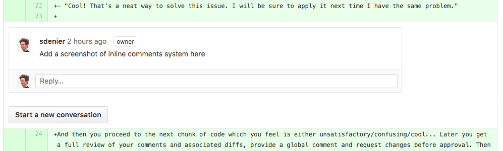

And then you proceed to the next chunk of code which you feel is either unsatisfactory/confusing/cool... Later you get a full review of your comments and associated diffs, provide a global comment and request changes before approval. Then the changeset gets updated by the original developer, and you can see at first sight which of your comments are still relevant and which ones are outdated, showing progress in the review process. Sometimes it just feels good...

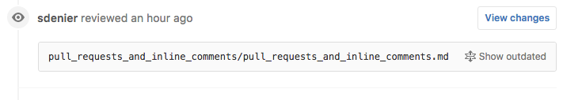

Wait! What just happens when we talked about outdated comments? How does GitHub knows whether my comment is still relevant or not? As is often the case in a complex system, complicated issues can hide in plain sight (1). Let's dive into the intricacies of keeping inline comments up to date during a code review process.

*(1) The real complexity lies in the diff algorithm, but we won't dive into it in this article.*


First Approach: High-Level Requirements
---------------------------------------

More often than not, inline comments are linked to changes. So they are attached to a representation of changes. In this post we will focus on a Unidiff representation (because it will be simpler to visualize and reason about than the side-by-side diff). This leads us to a first definition:

> An inline comment is a block of data (text) attached to a line in a unidiff.

Here is an example with a dummy unidiff. `Ax` represents one line content. Deleted lines are prefixed by `-` and added lines by `+`. Let's say A3 has been added and you put an inline comment on it.

```
  A1
  A2
+ A3   ### your inline comment: say nothing nice/nasty about this change
  A4
  A5
```

Now some changes are made and the pull request is updated. What can happen? For example, the reviewer requested that A3 is no good and should be deleted. The updated unidiff would look like:

```
  A1
  A2
  A4
  A5
```

Line A3 has disappeared. What can we do with the inline comment? It can not be displayed in a meaningful way, next to the line it was attached too, so it appears to be irrelevant, in other words outdated. Fair enough, we seem to have a simple rule to update an inline comment:

> If the inline comment is attached to a line which has disappeared with the last update, mark it as outdated.

Obviously, if line A3 still existed in the new update, we should have seen the inline comment as still relevant and would have keep it. What about this case?

```
  A1
+ B1
+ B2
  A2
+ A3   ### your inline comment: say nothing nice/nasty about this change
  A4
  A5
```

Rather than changing the A3 line, the update provides two new lines B1 and B2 (which become parts of the global pull request, including A3). The system can not decide whether the change resolves or even affects the inline comment. Thus, it should still display the comment to let the reviewer decided whether it is relevant or not. Of course, it should still appear next to the A3 line, which means in this case the comment has "moved down" from the third line in the original unidiff to the fifth line in the new unidiff.

> If the inline comment is still relevant w.r.t to the last update, it should follow the diff line to which it is attached.

As a side note, we can wonder what happen for an inline comment on line A4, which is kept from the original source. If we apply the same reasoning as above, we can infer straight away that the same rules apply. Also, nothing prevent us to add many inline comments to the same line. Let's rephrase the rules to clarify that:

> * If an added or kept line of the original unidiff is removed by the update, then any inline comments on the line become outdated.
>
> * If an added or kept line of the original unidiff is moved (up or down) by the update, then any inline comments on the line should follow the move.

These rules imply that inline comments system are able to track lines between changesets and identify which one has been removed and which one have moved. Notice we said nothing of lines which were already deleted in the original diff. We will save that for later!


An Intuition of Solution
------------------------

The first thing to recognize is that we do not deal with a single diff (a.k.a changeset) but at least two:

- the current (or original) diff from the pull request, on which comments were made
- the new diff from the pull request, after the update, which contains both updated changes and untouched original changes

Also, let index each content line by its offset in the diff. For starter, it is the simplest way to link an inline comment to its content line: we know that inline comment at offset 4 goes to line 4 in the unidiff.

Let's start with the following content:

```
  A1
  A2
  A3
  A4
  A5
```

We create a pull request which inserts a line B1 between A4 and A5. So the original unidiff for the pull request looks like:

```
1   A1
2   A2
3   A3
4   A4
5 + B1
6   A5
```

The review goes like this:

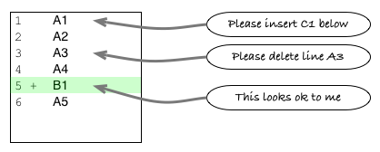

After review, it is decided to introduce another change between lines A1 and A2, and to delete A3, so the updated pull request looks like (notice how the deleted line still counts in the diff offset):

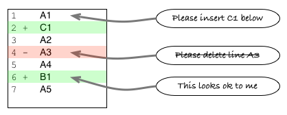

So far so good. Any inline comments on line 1 should stay in place. Any inline comments on the second line or below should move down by one line. The inline comment on A3 should be marked as outdated.

How do we know which lines does not change, which are deleted, and which are moved in the update? We can compute the update diff itself, which only contains changes between the current diff (current pull request state) and the updated pull request (i.e. it contains only changes made for the update).

In our example, since B1 change has already been introduced, the update diff looks like:

```
1   A1
2 + C1
3   A2
4 - A3
5   B1
6   A4
7   A5
```

What if we juxtapose the offset coordinates from the original diff on this one?

```
1 1   A1
  2 + C1
2 3   A2
3 4 - A3
4 5   B1
5 6   A4
6 7   A5
```

It is pretty easy to infer which lines were in the previous diff (kept and removed lines) and which ones are only in the new diff (added lines) - and thus, it is pretty easy to compute offsets for **both original and new diffs** on the update diff. We can then translate offsets from one space to the other.

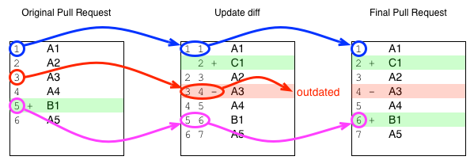

We can detail the procedure to update inline comments on an added or kept line:

> - take the offset of the inline comment in the original diff
> - then look up the corresponding line in the update diff
> - a) if line has been deleted by the update, mark the comment as outdated
> - b) otherwise, move the comment to the new offset given by the update diff


When the Intuition Falls Down (but is a Good First Start Anyway)
----------------------------------------------------------------

Right now we just talked about added and untouched lines in the diff. Let's make things a bit more complicated by having both added and deleted lines in the original pull request. What happens if we put inline comments on deleted lines?

```
1   A1
2 + B1
3   A2
4 - A3
5   A4
6   A5
```

 For example reviewer requests that line A3 should not be deleted. Do the above rules apply? Quite obviously, if the next update does not change the line, the comment holds. On the contrary, if the next update reestablish the line, then we can consider the comment to be outdated.

What if lines are moved around as in the updated pull request below?

```
1   A1
2 + C1
3 + B1
4   A2
5 - A3
6   A4
7   A5
```

The update diff would look like this (with offsets):

```
1 1   A1
  2 + C1
  3   B1
2 4   A2
4 5   A4
5 6   A5
```

Oups! Line A3 has disappeared from the diff (since it is already deleted) so we can no longer get its coordinates - the hint is that we no longer have the complete suite of offsets from the original diff in the leftmost column.


A Systematic Computation for Translation: Basic Case
----------------------------------------------------

Still, it looks like we were onto something when using our systems of offset coordinates and translations. Let's find a systematic way to do that.

We will describe each line in a unidiff with a triple coordinates system: offset in the diff, offset before change, offset after change. As noted above, it is pretty easy to infer such offsets just by iterating over each diff line and looking at their status (added, kept, or deleted). Let's compute unidiffs with a more in-depth example.

*Original* pull request:

```
// O = diff Offset, B = offset Before, A = offset After
O B A
1 1 1   A1
2   2 + B1
3   3 + B2
4   4 + B3
5 2 5   A2
6 3   - A3
7 4 6   A4
8 5 7   A5
```

*Update* diff (from original to final):

```
O B A
1 1 1   A1
2   2 + C1
3   3 + C2
4 2 4   B1
5 3   - B2
6 4 5   B3
7 5 6   A2
8 6   - A4
9 7 7   A5
```

*Final* pull request:

```
O B A
1 1 1   A1
2   2 + C1
3   3 + C2
4   4 + B1
5   5 + B3
6 2 6   A2
7 3   - A3
8 4   - A4
9 5 7   A5
```

With these rules for computing offsets, it is obvious that some offset columns offer a match between diffs. We can use these matches to look up and translate offsets between the diffs.

- The `Original[After]` column matches with the `Update[Before]` column
- The `Update[After]` column matches with the `Final[After]` column
- The `Original[Before]` column matches with the `Final[Before]` column

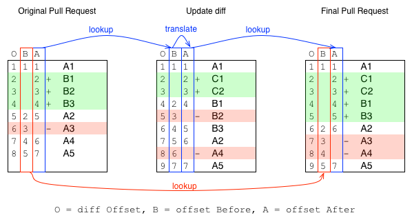

Then we can redefine the rules to update inline comments. For added or kept lines in the original diff:

> - translate `Original[O] -> Original[A]` in the original diff
> - look up the matching line `Original[A] = Update[B]` in the update diff
> - a) if line has been deleted by the update, mark the comment as outdated
> - b) otherwise, translate `Update[B] -> Update[A]`, look up `Update[A] = Final[A]` in the final diff, then translate `Final[A] -> Final[O]` to get the new offset in the final diff

For removed lines, the rules play differently:

> - translate `Original[O] -> Original[B]` in the original diff
> - look up the matching line `Original[B] = Final[B]` in the final diff
> - a) if the line is no longer deleted in the final diff, mark the comment as outdated
> - b) otherwise, translate `Final[B] -> Final[O]` to get the new offset in the final diff


It the rules seem a bit complicated, the visualization plays nicefully to understand the mechanism.

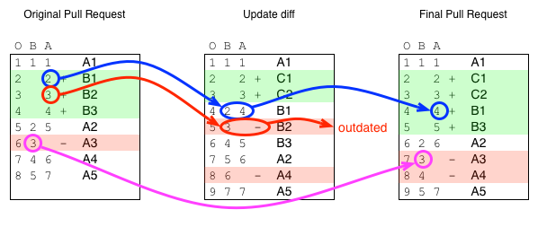


The General Problem and its Solution
------------------------------------

Did we really solve the full problem? Actually, we made a strong hidden hypothesis: the pull request base, against which the original diff is computed, never changes with update. In other words, the update is always a fast forward. But this is not necessarily the case. It is pretty common in a pull request to ask the developer to **rebase** changes against the latest source. Suddenly, the original diff against which inline comments were made does not reflect the state of the pull request before update. In other words, some comments may be outdated because the base itself has changed. Also, the updated (or 'final') pull request should now be computed against the new base to reflect the changes.

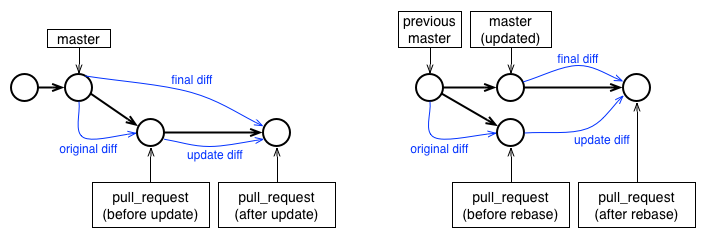

Here is an example. We will focus on deleted lines to illustrate the problems.

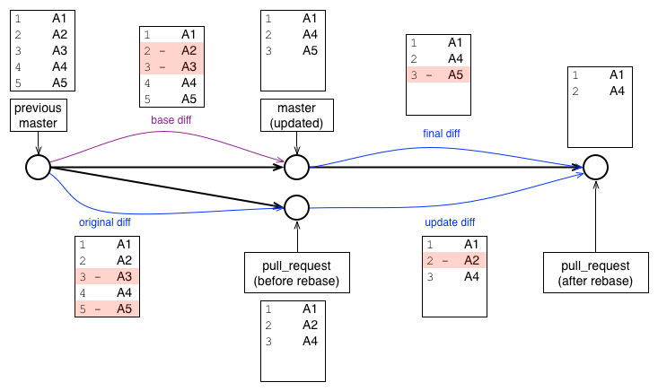

What has changed? The rebase has deleted two lines from the original base, including one which was also part of the pull request itself. This implies that any comment put on lines A2 and A3 are now outdated. Also some offsets should move around. Let's apply our previous procedure with three diffs:

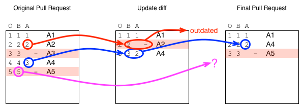

It seems we can still apply the rules to outdate or move inline comments on added or kept lines, *even though* the final diff is computed against a different base. This happens because both the final and update diffs have the same final state. However, we now have a problem with inline comments on deleted lines: especially the offset `Original[B]` does not match `Final[B]` for line A5. How can we translate the inline comment in this case?

Fortunately, we now have a good grasp about how diffs can be used to translate offsets. From the above *states and diffs* figure, it is quite obvious that the *base diff* is the missing link between the old master and the new master. Let's plug it into our translation schema.

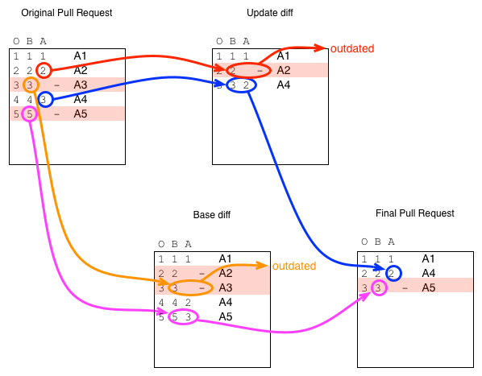

Again, it is important to notice how offset columns match between diffs:

- The `Original[After]` column matches with the `Update[Before]` column
- The `Update[After]` column matches with the `Final[After]` column
- The `Original[Before]` column matches with the `Base[Before]` column since they share the same old master state
- The `Base[After]` column matches with the `Final[Before]` column since it represents the new master state

We have a complete coverage of offsets, which allows us to always translate between diffs. We define the definitive rules for removed lines (since rebase does not affect added or kept lines, we do not change those rules):

> - translate `Original[O] -> Original[B]` in the original diff
> - look up the matching line `Original[B] = Base[B]` in the base diff
> - a) if the line is deleted in the base diff, mark the comment as outdated and STOP
> - otherwise, translate `Base[B] -> Base[A]` and look up `Base[A] = Final[B]` in the final diff
> - b) if the line is no longer deleted in the final diff, mark as outdated
> - c) otherwise, translate `Final[B] -> Final[O]` to get the new offset in the final diff

Notice that rules are now a bit more complicated for removed lines. In particular, there are two cases which mark comments as outdated. Rule (a) invalidates comments on lines which are already deleted in the base (as for the A3 line in the example) and rule (b) invalidates comments on lines which are reestablished in the final diff.

Conclusion
----------

As it happens, defining the algorithmic rules for updating inline comments was not so trivial. Cases like rebase long baffled us and we were not sure we understood how it impacted inline comments. Actually, it took us a few iterations to set things straight. Yet, once we found the gist of it, it looked surprisingly natural: we just describe the space of each changeset with some coordinates, identify how those spaces connect to each other, and apply rules to translate coordinates between connected spaces.
